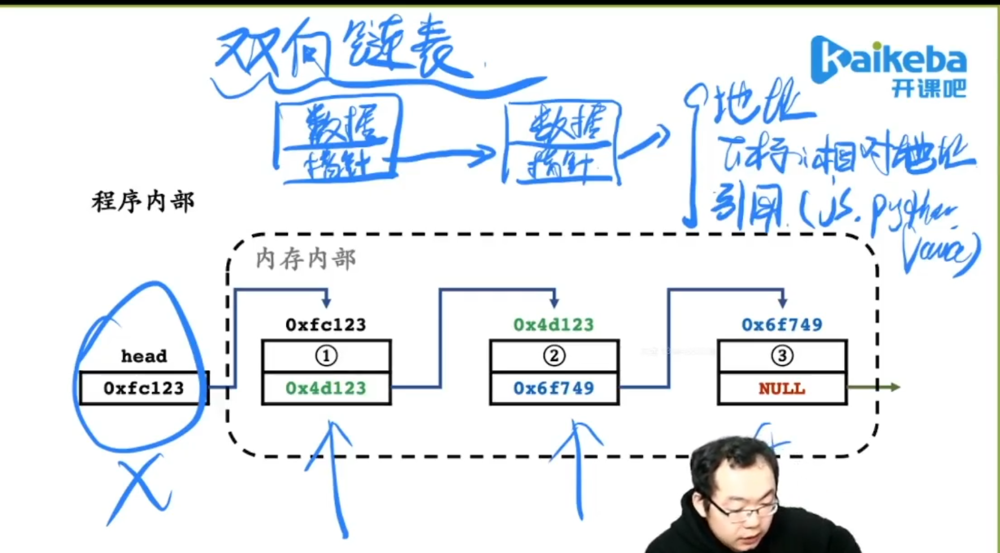

# 链表及其经典问题

Q:树也是特殊的链表吗？

A: 树就是树、链表就是链表。在程序实现方面，可以说二者相像。链表增加一个指针域就变成了二叉树。但是在思维逻辑结构方面来讲是完全不一样的。*不要把树当成一种特殊的链表*。有两个指针域的链表也是双向链表。


head就是一个指针，不是一个具体的对象(结点)

1.链表中的每个结点至少包含两个部分:数据域与指针域

2.链表中的每个结点，通过指针域的值，形成一个线性结构

3.查找结点 O(n)，插入结点 O(1)，删除结点 O(1)

4.不适合快速的定位数据，适合动态的插入和删除数据的应用场景

## 链表的几种实现

结构体：
```C++
struct Node {
     
};
```