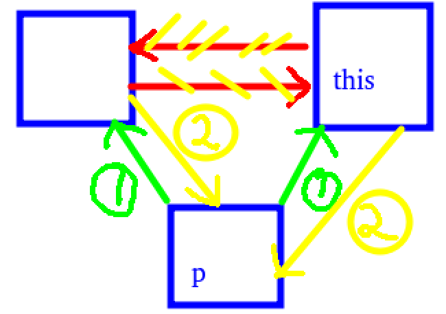
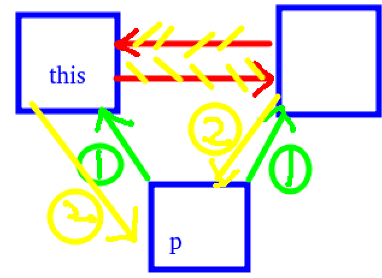
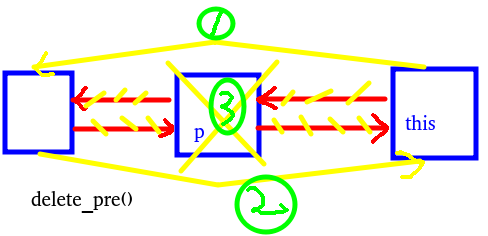
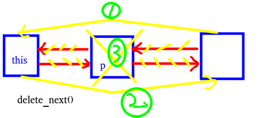

# 线程池与任务队列

## 队列基础知识

还是连续的存储区，可以是数组、链表，
头、尾指针，长度，元素类型

两种基本操作：出队、入队

普通的队列只支持从队首出队；

普通的队列只支持从队尾入队。

**如果能插队，就属于优先队列。**

FIFO 先入先出


普通队列会发生假溢出


改为循环队列即可防止假溢出

```C++
#include <iostream>
#include <vector>
using namespace std;

struct queue {
    int head, tail;
    int cnt;  // 循环队列，记录当前元素个数
    vector<int> arr;

    queue(int n = 10) : arr(n), head(0), tail(0), cnt(0) {}
    void push(int x) {  // 入队
        if (full()) {
            cout << "queue full\n";
            return;
        }
        // 标准定义中tail指向队尾元素的下一位
        // 原因是各种语言中描述一个区间时，通常采用[ )的形式
        // 优点是tail - head 正好等于当前元素个数
        arr[tail] = x;
        tail++;
        cnt++;  // 循环队列
        if (tail == arr.size())    tail = 0;  // 循环队列
    }
    void pop() {  // 出队
        if (empty()) {
            cout << "queue empty\n";
            return;
        }
        head++;
        cnt--;  // 循环队列
        if (head == arr.size())    head = 0;  // 循环队列
    }
    bool empty() {
        // return head == tail; // 普通队列
        return cnt == 0;  // 循环队列
    }
    bool full() {
        // return tail == arr.size(); // 普通队列
        return cnt == arr.size(); // 循环队列
    }
    int front() {
        return arr[head];
    }
    int size() {
        // return tail - head;
        return cnt; // 循环队列
    }
    void output() {
        cout << "Queue : ";
        // for (int i = head; i < tail; i++) { // 普通队列
        //     cout << arr[i] << " ";
        // } cout << endl;
        for (int i = 0, j = head; i < cnt; i++) { // 循环队列
            cout << arr[j] << " ";
            j++;
            if (j == arr.size()) j = 0;
        } cout << endl;
    }
    void clear() {
        head = tail = cnt = 0;
    }
};

int main() {
    string op;
    int val;
    queue q(5);
    while (cin >> op) {
        if (op == "insert") {
            cin >> val;
            q.push(val);
        } else if (op == "front") {
            cout << "front element : " << q.front() << endl;
        } else if (op == "pop") {
            q.pop();
        } else if (op == "size") {
            cout << "queue size : " << q.size() << endl;
        }
        q.output();
    }
    return 0;
}
```

循环队列代码，用cnt实现统计长度作为判断队列是否full技巧，而不是tail + 1 == head的方法。
empty同理。


## 队列通常的作用是当作缓冲区：
**当前处理不完的事情，放在队列中，待会儿再处理。**
这是队列通常的作用。

（贪心：偏序性证明）

## 队列的封装与使用

**leetcode 622 设计循环队列**

技巧还是用cnt记录总元素数量，这样就可以放满

```C++
class MyCircularQueue {
public:
    vector<int> arr;
    int head, tail, cnt;
    MyCircularQueue(int k) : arr(k), head(0), tail(0), cnt(0) {}
    
    bool enQueue(int value) {
        if (isFull()) return false;
        arr[tail] = value;
        tail = (tail + 1) % arr.size();
        cnt++; 
        return true;
    }
    
    bool Dequeue() {
        if (empty()) return false;
        head = (head + 1) % arr.size();
        cnt--;
        return true;
    }
    
    int Front() {
        if (empty()) return -1;
        return arr[head];
    }
    
    int Rear() {
        if (empty()) return -1;
        // (x + n) % n不影响结果，还防止了x是负数，解决tail = 0的情况
        return arr[(tail - 1 + arr.size()) % arr.size()];
    }
    
    bool empty() {
        return cnt == 0;
    }
    
    bool isFull() {
        return cnt == arr.size();
    }
};
```

**leetcode 641 设计双向循环队列**

两头都可以出入队。Deque，双端队列，queue的底层是基于Deque实现的。

```C++
class MyCircularDeque {
public:
    vector<int> arr;
    int cnt, head, tail;
    MyCircularDeque(int k) : arr(k), cnt(0), head(0), tail(0) {}
    
    // head位置是有元素的，tail是无元素的
    bool insertFront(int value) {
        if (isFull()) return false;
        // head--;
        // if (head == -1) head = arr.size() - 1;
        head = (head - 1 + arr.size()) % arr.size();
        arr[head] = value;
        cnt++;
        return true;
    }
    
    bool insertLast(int value) {
        if (isFull()) return false;
        arr[tail] = value;
        tail++;
        if (tail == arr.size()) tail = 0;
        cnt++;
        return true;
    }
    
    bool deleteFront() {
        if (empty()) return false;
        head++;
        if (head == arr.size()) head = 0;
        cnt--;
        return true;
    }
    
    bool deleteLast() {
        if (empty()) return false;
        // tail--;
        // if (tail == -1) tail = arr.size() - 1;
        tail = (tail - 1 + arr.size()) % arr.size();
        cnt--;
        return true;
    }
    
    int getFront() {
        if (empty()) return -1;
        return arr[head];
    }
    
    int getRear() {
        if (empty()) return -1;
        return arr[(tail - 1 + arr.size()) % arr.size()];
    }
    
    bool empty() {
        return cnt == 0;
    }
    
    bool isFull() {
        return cnt == arr.size();
    }
};
```

**leetcode 1670 设计前中后队列**

两个双端队列维护一个前中后队列。

1.先实现双端队列，本题用链表实现双端队列，以便在中间插入的时候可以O(1)发挥极致性能。

2.实现一个链表结构Node。
```C++
struct Node {
    int val;
    Node *next;
    Node(int val = 0, Node *next = nullptr) : val(val), next(next) {}
};
```
3.实现一个双端队列Deque。
```C++
struct Deque {
    Deque() {}
    void push_back() {}
    void push_front() {}
    int pop_back() {}
    int pop_front() {}
    bool empty() {}
    // 不需要Full() 因为链表逻辑上不会Full
};
```

4.通过虚拟头结点、虚拟尾结点来实现双端队列，所以修改链表为双向链表。
```C++
struct Node {
    int val;
    Node *next, *pre;
    Node(int val = 0, Node *pre = nullptr, Node *next = nullptr) : val(val), pre(pre), next(next) {}
};
```

5.在Deque中实现虚拟头、虚拟尾。
```C++
struct Deque {
    Node head, tail;
    Deque() {
        head.next = &tail;
        head.pre = nullptr;
        tail.next = nullptr;
        tail.pre = &head;
    }
    ... ...
};
```

6.实现push_back(), 本质就是在tail前面插入结点，
所以在Node结构中封装insert_pre(Node *p)在当前结点前插入结点。



7.同理为了实现push_front(), 在Node结构中封装insert_next(Node *p)
在当前结点后面插入结点。



```C++
struct Node {
    ... ...
    void insert_pre(Node *p) {
        p->pre = this->pre;
        p->next = this;
        if (this->pre) this->pre->next = p;
        this->pre = p;
    }
    void insert_next(Node *p) {
        p->pre = this;
        p->next = this->next;
        if (this->next) this->next->pre = p;
        this->next = p;
    }
};

struct Deque {
    ... ...
    void push_back(int val) {
        tail.insert_pre(new Node(val));
    }
    void push_front(int val) {
        head.insert_next(new Node(val));
    }
    ... ...
};
```

8.实现pop_back()、pop_front(),需要在Node结构中实现delete操作：
但是pop需要看是否empty，先实现empty() :
```C++
struct Deque {
    ... ...
    bool empty() {
        return head.next == &tail;
    }
    ... ...
};
```
然后在Node结构中实现delete_pre()、delete_next()操作：



```C++
struct Node {
    ... ...
    void delete_pre() {
        if (this->pre == nullptr) return;
        Node *p = this->pre;
        this->pre = p->pre;
        if (p->pre) p->pre->next = this;
        delete p;
    }
    void delete_next() {
        if (this->next == nullptr) return;
        Node *p = this->next;
        this->next = p->next;
        if (p->next) p->next->pre = this;
        delete p;
    }
    ... ...
};

struct Deque {
    ... ...
    int pop_back() {
        if (empty()) return -1;
        int ret = tail.pre->val;
        tail.delete_pre();
        return ret;
    }
    int pop_front() {
        if (empty()) return -1;
        int ret = head.next->val;
        head.delete_next();
        return ret;
    }
    ... ...
};

```
9.Deque补充size()方法、front()方法、back()方法：
```C++
struct Deque {
    ... ...
    int cnt;
    Deque() : cnt(0) {
        ... ...
    }
    void push_back(int val) {
        ... ...
        cnt++;
    }
    void push_front(int val) {
        ... ...
        cnt++;
    }
    void pop_back() {
        ... ...
        cnt--;
    }
    void pop_front() {
        ... ...
        cnt--;
    }
    int size() {
        return cnt;
    }
    int front() {
        return head.next->val;
    }
    int back() {
        return tail.pre->val;
    }
};
```
至此Deque实现完毕。

10.开始实现FrontMiddleBackQueue：

先定义两个Deque, 规定 q1 >= q2

按照1～7的顺序实现。

```C++
class FrontMiddleBackQueue {
public:
    Deque q1, q2;
    FrontMiddleBackQueue() {}
    // 1.
    void pushFront(int val) {
        q1.push_front(val);
        update(); // 2.保证q1 >= q2
    }
    // 6.
    void pushMiddle(int val) {
        if (q1.size() > q2.size()) {
            q2.push_front(q1.back());
            q1.pop_back();
        }
        q1.push_back(val);
        // update();
    }
    // 3.
    void pushBack(int val) {
        q2.push_back(val);
        update();
    }
    // 4.
    int popFront() {
        if (empty()) return -1;
        int ret = q1.pop_front();
        update();
        return ret;
    }
    // 7.
    int popMiddle() {
        if (empty()) return -1;
        int ret = q1.pop_back();
        update();
        return ret;
    }
    // 5.
    int popBack() {
        if (empty()) return -1;
        int ret;
        if (q2.empty()) { // 可能出现q1:[x] q2:[]
            ret = q1.pop_back();
        } else {
            ret = q2.pop_back();
        }
        update();
        return ret;
    }
    bool empty() {
        return q1.size() + q2.size() == 0;
    }
    // 2.
    void update() {
        if (q1.size() < q2.size()) {
            q1.push_back(q2.front());
            q2.pop_front();
        }
        if (q1.size() == q2.size() + 2) {
            q2.push_front(q1.back());
            q1.pop_back();
        }
        return ;
    }
};
```

完整代码：
```c++
struct Node {
    int val;
    Node *next, *pre;
    Node(int v = 0, Node *pre = nullptr, Node *next = nullptr) : val(v), pre(pre), next(next) {}
    void insert_pre(Node *p) {
        p->pre = this->pre;
        p->next = this;
        if (this->pre) this->pre->next = p;
        this->pre = p;
    }
    void insert_next(Node *p) {
        p->pre = this;
        p->next = this->next;
        if (this->next) this->next->pre = p;
        this->next = p;
    }
    void delete_pre() {
        if (this->pre == nullptr) return;
        Node *p = this->pre;
        this->pre = p->pre;
        if (p->pre) p->pre->next = this;
        delete p;
    }
    void delete_next() {
        if (this->next == nullptr) return;
        Node *p = this->next;
        this->next = p->next;
        if (p->next) p->next->pre = this;
        delete p;
    }
};

struct Deque {
    Node head, tail;
    int cnt;
    Deque() : cnt(0) {
        head.next = &tail;
        head.pre = nullptr;
        tail.next = nullptr;
        tail.pre = &head;
    }
    void push_back(int val) {
        tail.insert_pre(new Node(val));
        cnt++;
    }
    void push_front(int val) {
        head.insert_next(new Node(val));
        cnt++;
    }
    int pop_back() {
        if (empty()) return -1;
        int ret = tail.pre->val;
        tail.delete_pre();
        cnt -= 1;
        return ret;
    }
    int pop_front() {
        if (empty()) return -1;
        int ret = head.next->val;
        head.delete_next();
        cnt -= 1;
        return ret;
    }
    int front() {
        return head.next->val;
    }
    int back() {
        return tail.pre->val;
    }
    bool empty() {
        return head.next == &tail;
    }
    // 不需要isFull() 因为链表逻辑上不会Full
    int size() {
        return cnt;
    }
};

class FrontMiddleBackQueue {
public:
    Deque q1, q2;
    FrontMiddleBackQueue() {}
    
    void pushFront(int val) {
        q1.push_front(val);
        update();
    }
    
    void pushMiddle(int val) {
        if (q1.size() > q2.size()) {
            q2.push_front(q1.back());
            q1.pop_back();
        }
        q1.push_back(val);
        // update();
    }
    
    void pushBack(int val) {
        q2.push_back(val);
        update();
    }
    
    int popFront() {
        if (empty()) return -1;
        int ret = q1.pop_front();
        update();
        return ret;
    }
    
    int popMiddle() {
        if (empty()) return -1;
        int ret = q1.pop_back();
        update();
        return ret;
    }
    
    int popBack() {
        if (empty()) return -1;
        int ret;
        if (q2.empty()) {
            ret = q1.pop_back();
        } else {
            ret = q2.pop_back();
        }
        update();
        return ret;
    }
    bool empty() {
        return q1.size() + q2.size() == 0;
    }
    void update() {
        if (q1.size() < q2.size()) {
            q1.push_back(q2.front());
            q2.pop_front();
        }
        if (q1.size() == q2.size() + 2) {
            q2.push_front(q1.back());
            q1.pop_back();
        }
        return ;
    }
};
```

**练习：修改为q1 <= q2 **:
```C++
struct Node {
    int val;
    Node *next, *pre;
    Node(int v = 0, Node *pre = nullptr, Node *next = nullptr) : val(v), pre(pre), next(next) {}
    void insert_pre(Node *p) {
        p->pre = this->pre;
        p->next = this;
        if (this->pre) this->pre->next = p;
        this->pre = p;
    }
    void insert_next(Node *p) {
        p->pre = this;
        p->next = this->next;
        if (this->next) this->next->pre = p;
        this->next = p;
    }
    void delete_pre() {
        if (this->pre == nullptr) return;
        Node *p = this->pre;
        this->pre = p->pre;
        if (p->pre) p->pre->next = this;
        delete p;
    }
    void delete_next() {
        if (this->next == nullptr) return;
        Node *p = this->next;
        this->next = p->next;
        if (p->next) p->next->pre = this;
        delete p;
    }
};

struct Deque {
    Node head, tail;
    int cnt;
    Deque() : cnt(0) {
        head.next = &tail;
        head.pre = nullptr;
        tail.next = nullptr;
        tail.pre = &head;
    }
    void push_back(int val) {
        tail.insert_pre(new Node(val));
        cnt++;
    }
    void push_front(int val) {
        head.insert_next(new Node(val));
        cnt++;
    }
    int pop_back() {
        if (empty()) return -1;
        int ret = tail.pre->val;
        tail.delete_pre();
        cnt -= 1;
        return ret;
    }
    int pop_front() {
        if (empty()) return -1;
        int ret = head.next->val;
        head.delete_next();
        cnt -= 1;
        return ret;
    }
    int front() {
        return head.next->val;
    }
    int back() {
        return tail.pre->val;
    }
    bool empty() {
        return head.next == &tail;
    }
    // 不需要isFull() 因为链表逻辑上不会Full
    int size() {
        return cnt;
    }
};

class FrontMiddleBackQueue {
public:
    Deque q1, q2;
    // 强制要求q1 <= q2
    FrontMiddleBackQueue() {}
    
    void pushFront(int val) {
        q1.push_front(val);
        update();
        // print();
        return ;
    }
    
    void pushMiddle(int val) {
        q1.push_back(val);
        update();
        // print();
        return ;
    }
    
    void pushBack(int val) {
        q2.push_back(val);
        update();
        // print();
        return ;
    }
    
    int popFront() {
        if (empty()) return -1;
        int ret;
        if (q1.empty()) {
            ret = q2.pop_front();
        } else {
            ret = q1.pop_front();
        }
        update();
        // print();
        return ret;
    }
    
    int popMiddle() {
        if (empty()) return -1;
        if (q1.size() == q2.size()) {
            q2.push_front(q1.back());
            q1.pop_back();
        }
        int ret = q2.pop_front();
        update();
        // print();
        return ret;
    }
    
    int popBack() {
        if (empty()) return -1;
        int ret = q2.pop_back();
        update();
        // print();
        return ret;
    }
    bool empty() {
        return q1.size() + q2.size() == 0;
    }
    void update() {
        if (q1.size() > q2.size()) {
            q2.push_front(q1.back());
            q1.pop_back();
        }
        if (q1.size() + 2 == q2.size()) {
            q1.push_back(q2.front());
            q2.pop_front();
        }
        return ;
    }

    void print() {
        Node *p = q1.head.next;
        printf("q1:");
        for (int i = 0; i < q1.cnt; i++) {
            printf("%d->", p->val);
            p = p->next;
        }
        printf(" q2:");
        p = q2.head.next;
        for (int i = 0; i < q2.cnt; i++) {
            printf("%d->", p->val);
            p = p->next;
        }
        printf("\n");
        
    }
};
```

**leetcode 933 最近的请求次数**

```c++
class RecentCounter {
public:
    queue<int> q;
    RecentCounter() {}
    
    int ping(int t) {
        q.push(t);
        while (t - q.front() > 3000) q.pop();
        return q.size();
    }
};
```
或者
```c++
class RecentCounter {
public:
    deque<int> q;
    RecentCounter() {}
    
    int ping(int t) {
        q.push_back(t);
        while (t - q.front() > 3000) q.pop_front();
        return q.size();
    }
};
```
