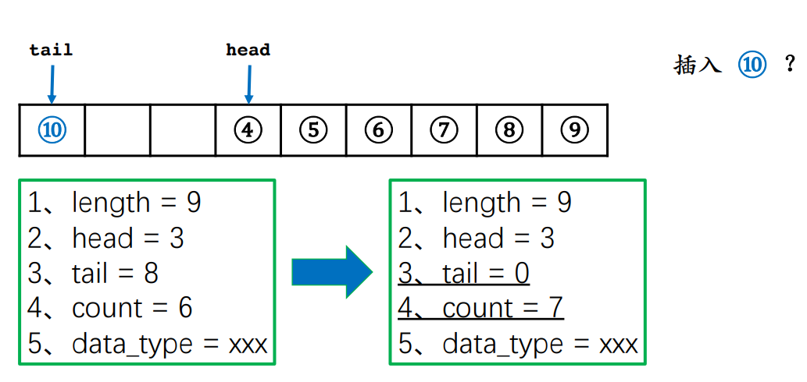

# 线程池与任务队列

## 队列基础知识

还是连续的存储区，可以是数组、链表，
头、尾指针，长度，元素类型

两种基本操作：出队、入队

普通的队列只支持从队首出队；

普通的队列只支持从队尾入队。

**如果能插队，就属于优先队列。**

FIFO 先入先出


普通队列会发生假溢出



改为循环队列即可防止假溢出

```C++
#include <iostream>
#include <vector>
using namespace std;

struct queue {
    int head, tail;
    int cnt;  // 循环队列，记录当前元素个数
    vector<int> arr;

    queue(int n = 10) : arr(n), head(0), tail(0), cnt(0) {}
    void push(int x) {  // 入队
        if (full()) {
            cout << "queue full\n";
            return;
        }
        // 标准定义中tail指向队尾元素的下一位
        // 原因是各种语言中描述一个区间时，通常采用[ )的形式
        // 优点是tail - head 正好等于当前元素个数
        arr[tail] = x;
        tail++;
        cnt++;  // 循环队列
        if (tail == arr.size())    tail = 0;  // 循环队列
    }
    void pop() {  // 出队
        if (empty()) {
            cout << "queue empty\n";
            return;
        }
        head++;
        cnt--;  // 循环队列
        if (head == arr.size())    head = 0;  // 循环队列
    }
    bool empty() {
        // return head == tail; // 普通队列
        return cnt == 0;  // 循环队列
    }
    bool full() {
        // return tail == arr.size(); // 普通队列
        return cnt == arr.size(); // 循环队列
    }
    int front() {
        return arr[head];
    }
    int size() {
        // return tail - head;
        return cnt; // 循环队列
    }
    void output() {
        cout << "Queue : ";
        // for (int i = head; i < tail; i++) { // 普通队列
        //     cout << arr[i] << " ";
        // } cout << endl;
        for (int i = 0, j = head; i < cnt; i++) { // 循环队列
            cout << arr[j] << " ";
            j++;
            if (j == arr.size()) j = 0;
        } cout << endl;
    }
    void clear() {
        head = tail = cnt = 0;
    }
};

int main() {
    string op;
    int val;
    queue q(5);
    while (cin >> op) {
        if (op == "insert") {
            cin >> val;
            q.push(val);
        } else if (op == "front") {
            cout << "front element : " << q.front() << endl;
        } else if (op == "pop") {
            q.pop();
        } else if (op == "size") {
            cout << "queue size : " << q.size() << endl;
        }
        q.output();
    }
    return 0;
}
```

循环队列代码，用cnt实现统计长度作为判断队列是否full技巧，而不是tail + 1 == head的方法。
empty同理。


## 队列通常的作用是当作缓冲区：
**当前处理不完的事情，放在队列中，待会儿再处理。**
这是队列通常的作用。

（贪心：偏序性证明）