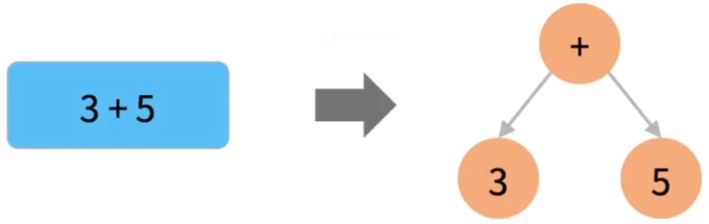

# 栈与递归：解决表达式求值

## 栈的基础知识

FILO先入后出

出栈

入栈


### 栈适合解决什么问题？

从leetcode 20 有效的括号引入：

给定一个只包括 '('，')'，'{'，'}'，'['，']' 的字符串 s ，判断字符串是否有效。

---

有效字符串需满足：

1.左括号必须用相同类型的右括号闭合。

2.左括号必须以正确的顺序闭合。

3.每个右括号都有一个对应的相同类型的左括号。

---

**先问题简化成只有⼀种括号 ( )，怎么做?**

结论：

1.在任意一个位置上，左括号数量 >= 右括号数量

2.在最后一个位置上，左括号数量 == 右括号数量

3.程序中只需要记录左括号数量和右括号数量即可

```C++
bool isValid(string s) {
    int lnum = 0, rnum = 0;
    int len = s.length();
    for (int i = 0; i < len; i++) {
        switch (s[i]) {
            case '(' : lnum++; break;
            case ')' : rnum++; break;
            default : return false;
        }
        if (lnum >= rnum) continue;
        return false;
    }
    return lnum == rnum;
}
```

**思考：rnum 变量⼀定是需要的么？**

```C++
bool isValid(string s) {
    int lnum = 0;
    int len = s.length();
    for (int i = 0; i < len; i++) {
        switch (s[i]) {
            case '(' : lnum++; break;
            case ')' : lnum--; break;
            default : return false;
        }
        if (lnum >= 0) continue;
        return false;
    }
    return lnum == 0;
}
```

**引出重点思考的结论：**

1.我们获得了怎样新的思维⽅式？

2.+1 可以等价为『进』，-1可以等价为『出』

3.⼀对()可以等价为⼀个完整的事件

4.( () )可以看做事件与事件之间的完全包含关系

5.由括号的等价变换，得到了⼀个新的数据结构


可以处理具有**完全包含**关系的问题
---
如：括号匹配问题、操作系统线程栈、 表达式求值问题等。


（（） （）） 括号可看成dfs二叉树，或者表示函数调用关系，如下图：


### 经典栈的实现方法

```C++
//
```

## 栈的经典应用场景

### 场景1 操作系统中的线程栈

线程空间是线程栈 ulimit -a 看到的stack就是线程栈的大小。


### 场景2 表达式求值

递归用的是系统栈，跟我们自己手动实现的栈没有本质差别。



思维逻辑上把表达式想象成二叉树。


3 * (4 + 5)思维逻辑上是一个乘法表达式，而(4 + 5)是一个子问题。一个完全包含问题。

因为乘法是最后计算的，所以它是乘法表达式。本质上是整个表达式运算符优先级最低的。

如何递归求解：

1.假设有一个递归函数clac()，这是用来算一个大的表达式的递归函数。


