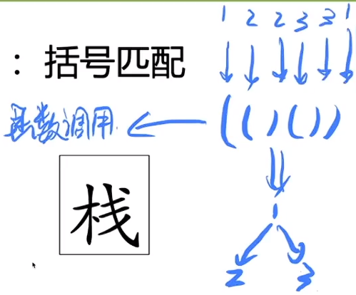

# 栈与递归：解决表达式求值

## 栈的基础知识

FILO先入后出

出栈

入栈

### 经典栈的实现方法

```C++
#include <iostream>
#include <vector>
using namespace std;

// struct Stack {
//     vector<int> data;
//     Stack() {}
//     void push(int x) {
//         data.push_back(x);
//     }
//     void pop() {
//         if (empty()) return;
//         data.pop_back();
//     }
//     bool empty() {
//         return (data.size() == 0 && cout << "stack empty\n");
//     }
//     int size() {
//         return data.size();
//     }
//     void output() {
//         cout << "==========\n";
//         for (int i = data.size() - 1; i >= 0; i--) {
//             cout << " " << data[i] << endl;
//         }
//         cout << "==========\n";
//     }
// };

struct Stack {
    int *data, top;
    Stack(int n = 100) {
        top = -1; // empty
        data = new int[n];
    }
    void push(int x) {
        top += 1;
        data[top] = x;
    }
    void pop() {
        if (empty()) return;
        top--;
    }
    bool empty() {
        return (top == -1 && cout << "stack empty\n");
    }
    int size() {
        return top + 1;
    }
    void output() {
        cout << "==========\n";
        for (int i = top; i >= 0; i--) {
            cout << " " << data[i] << endl;
        }
        cout << "==========\n";
    }
};

int main() {
    Stack s;
    string op;
    int val;
    while (cin >> op) {
        if (op == "push") {
            cin >> val;
            s.push(val);
        } else if (op == "pop") {
            s.pop();
        } else if (op == "size") {
            cout << "size : " << s.size() << endl;
        } else if (op == "output") {
            s.output();
        }

    }
    return 0;
}
```

### 栈适合解决什么问题？

从leetcode 20 有效的括号引入：

给定一个只包括 '('，')'，'{'，'}'，'['，']' 的字符串 s ，判断字符串是否有效。

---

有效字符串需满足：

1. 左括号必须用相同类型的右括号闭合。
2. 左括号必须以正确的顺序闭合。
3. 每个右括号都有一个对应的相同类型的左括号。

---

**先问题简化成只有⼀种括号 ( )，怎么做?**

结论：

1. 在任意一个位置上，左括号数量 >= 右括号数量
2. 在最后一个位置上，左括号数量 == 右括号数量
3. 程序中只需要记录左括号数量和右括号数量即可

```C++
bool isValid(string s) {
    int lnum = 0, rnum = 0;
    int len = s.length();
    for (int i = 0; i < len; i++) {
        switch (s[i]) {
            case '(' : lnum++; break;
            case ')' : rnum++; break;
            default : return false;
        }
        if (lnum >= rnum) continue;
        return false;
    }
    return lnum == rnum;
}
```

**思考：rnum 变量⼀定是需要的么？**

```C++
bool isValid(string s) {
    int lnum = 0;
    int len = s.length();
    for (int i = 0; i < len; i++) {
        switch (s[i]) {
            case '(' : lnum++; break;
            case ')' : lnum--; break;
            default : return false;
        }
        if (lnum >= 0) continue;
        return false;
    }
    return lnum == 0;
}
```

**引出重点思考的结论：**

1. 我们获得了怎样新的思维⽅式？
2. +1 可以等价为『进』，-1可以等价为『出』
3. ⼀对()可以等价为⼀个完整的事件
4. ( () )可以看做事件与事件之间的完全包含关系
5. 由括号的等价变换，得到了⼀个新的数据结构


可以处理具有**完全包含**关系的问题
---
如：括号匹配问题、操作系统线程栈、 表达式求值问题等。


（（） （）） 括号可看成dfs二叉树，或者表示函数调用关系，如下图：



## 栈的经典应用场景

### 场景1 操作系统中的线程栈

线程空间是线程栈 ulimit -a 看到的stack就是线程栈的大小。

多线程编程对系统也是有额外负担的，因为申请一个线程就占用8M空间，如果申请1000个线程，那么线程栈将会占用8GB大小。


### 场景2 表达式求值

递归用的是系统栈，跟我们自己手动实现的栈没有本质差别。

思维逻辑上把表达式想象成二叉树。


3 * (4 + 5)思维逻辑上是一个乘法表达式，而(4 + 5)是一个子问题。一个完全包含问题。

因为乘法是最后计算的，所以它是乘法表达式。本质上是整个表达式运算符优先级最低的。


如何递归求解：

1. 假设有一个递归函数clac()，这是用来算一个大的表达式的递归函数。
2. 然后找到整个表达式运算符优先级最低的位置(关键步骤)，拆成两部分。
3. 然后再调用calc()函数继续对这两部分求解。
4. 给 + - * /赋予基础优先级， 如+-是1、*/是2，()是100
则3 * (4 + 5)中 *优先级是2、(+)优先级是101。


calc()函数思路：

1. 先找运算符优先级最低的位置
2. 分治递归运算左部分的值和右部分的值
3. 如果是纯数字：return数字；否则继续分治递归


```C++
#include <stdio.h>
#include <string.h>
#include <ctype.h>
#include <stdlib.h>

int calc(char *s, int l, int r) {
    int op = -1; // 最低优先级的位置
    int pri = 99999; // 当前最低运算符优先级（初始化一个极大值打擂台）
    int cur_pri; // 当前运算符的优先级
    int temp = 0; // 由括号()额外增加的运算符优先级

    // 找全局运算符优先级最低的位置
    for (int i = l; i <= r; i++) {
        cur_pri = 100000;
        switch (s[i]) {
            case '+':
            case '-': cur_pri = 1 + temp; break;
            case '*':
            case '/': cur_pri = 2 + temp; break;
            case '(': temp += 100; break;
            case ')': temp -= 100; break;
        }
        // 打擂台找pri
        if (cur_pri <= pri) { // cur_pri <= pri是安全的，因为它总是考虑相同优先级的运算符。
        // 使用 (cur_pri < pri) 也是可行的，因为递归调用保证了正确的计算顺序，但这种方法可能在其他上下文中引起混淆。
            pri = cur_pri;
            op = i;
        }
    }
    // op == -1 说明是个纯数字
    if (op == -1) {
        // 把当前这段字符串转成数字
        int num = 0;
        for (int i = l; i <= r; i++) {
            if (!isdigit(s[i])) continue;
            num = num * 10 + s[i] - '0';
        }
        return num;
    }

    // debug用 : 输出找到运算符优先级最低的是什么
    printf("calc find : %c op = %d\n", s[op], op);

    // 否则计算表达式两侧的值
    int a = calc(s, l, op - 1);
    int b = calc(s, op + 1, r);
    switch (s[op]) {
        case '+': return a + b;
        case '-': return a - b;
        case '*': return a * b;
        case '/': return a / b;
    }
    return 0;
}

int main() {
    char s[100];
    while (~scanf("%[^\n]", s)) {
        getchar(); // 清除卡在输入缓冲区中的'\n'
        printf("%s = %d\n", s, calc(s, 0, strlen(s) - 1));
    }
}
```


##  栈的基本操作

**leetcode 03.04 化栈为队**

```C++
class MyQueue {
public:
    stack<int> s1, s2;
    /** Initialize your data structure here. */
    MyQueue() {}
    
    /** Push element x to the back of queue. */
    void push(int x) {
        s2.push(x);
    }
    
    /** Removes the element from in front of queue and returns that element. */
    int pop() {
        transfer();
        int ret = s1.top();
        s1.pop();
        return ret;
    }
    
    /** Get the front element. */
    int peek() {
        transfer();
        return s1.top();
    }
    
    /** Returns whether the queue is empty. */
    bool empty() {
        return s1.empty() && s2.empty();
    }
    void transfer() {
        if (!s1.empty()) return;
        while (!s2.empty()) {
            s1.push(s2.top());
            s2.pop();
        }               
    }
};
```

**leetcode 682 棒球比赛**


```C++
class Solution {
public:
    int calPoints(vector<string>& op) {
        stack<int> s;
        for (int i = 0; i < op.size(); i++) {
            if (op[i] == "+") {
                int a = s.top();
                s.pop();
                int b = s.top();
                s.push(a);
                s.push(a + b);
            } else if (op[i] == "D") {
                s.push(2 * s.top());
            } else if (op[i] == "C") {
                s.pop();
            } else { // 数字
                s.push(stoi(op[i]));
            }
        }
        int sum = 0;
        while (!s.empty()) {
            sum += s.top();
            s.pop();
        }
        return sum;
    }
};
```
**leetcode 844 比较含退格的字符串**

小模拟题，字符串逐个字符放到栈里，遇到#就pop，最后两个栈一个一个对比。

```C++
class Solution {
public:
    void transfer(const string &str, stack<char> &s) {
        for (int i = 0; i < str.size(); i++) {
            if (str[i] == '#' && !s.empty()) s.pop();
            else if (str[i] != '#') s.push(str[i]);
        }
    }

    bool backspaceCompare(string S, string T) {
        stack<char> s, t;
        transfer(S, s);
        transfer(T, t);
        if (s.size() - t.size()) return false;
        while (!s.empty()) {
            if (s.top() != t.top()) return false;
            s.pop();
            t.pop();
        }
        return true;
    }
};
```

**leetcode 946 验证栈序列**

考察栈操作性质的理解，只需要关注出栈序列即可。

比如：pushed = [1,2,3,4,5], popped = [4,5,3,2,1]中
第一个pop的是4，那么肯定push到4以后，才能pop出4。


此时分析第二个要pop的元素只有两种情况：
1. 现有的top栈顶元素
2. 未来要push入栈的元素

所以只需要关注出栈序列即可(当前栈顶、未来入栈)。

**所以只需要判断当前pop序列的元素在不在栈顶，如果不在栈顶，则继续从入栈序列入栈即可。如果入栈完还是不在栈顶，则肯定false**

```C++
class Solution {
public:
    bool validateStackSequences(vector<int>& pushed, vector<int>& popped) {
        stack<int> s;
        // i表示出栈序列的第i位、j表示入栈序列的位置
        for (int i = 0, j = 0; i < popped.size(); i++) {
            // s为空 或 poped的元素不在栈顶，则继续从pushed入栈s
            while (j < pushed.size() && (s.empty() || s.top() != popped[i])) {
                s.push(pushed[j++]);
            }
            if (s.top() != popped[i]) return false;
            s.pop(); // i++ 两个栈同时pop
        }
        return true; // 能结束for则表示能正常pop清空
    }
};
```

## 栈结构扩展应用

**leetcode 20 有效的括号**

用栈模拟；

    如果是左括号就入栈

    如果是右括号就和栈顶指针比较

        如果能匹配，就正常出栈

        如果不能匹配，则一定非法

```C++
class Solution {
public:
    bool isValid(string s) {
        stack<char> ss;
        for (int i = 0; i < s.size(); i++) {
            switch (s[i]) {
                case '(':
                case '[':
                case '{': ss.push(s[i]); break;
                case ')': 
                    if (ss.empty() || ss.top() != '(')  return false;
                    ss.pop();
                    break;
                case ']':
                    if (ss.empty() || ss.top() != '[')  return false;
                    ss.pop();
                    break;
                case '}':
                    if (ss.empty() || ss.top() != '{')  return false;
                    ss.pop();
                    break;
            }
        }
        return ss.empty();
    }
};
```

**leetcode 1021 删除最外层的括号**

    题目意思是 把(()())(()) 分成(()()) 和 (())

    然后去掉这两个最外面的括号，得到的结果就是()()()

    所以，如何分割出 独立的括号部分？

    可以统计左右括号的数量、差值，当差值为0时，得到是就是独立的部分。


    所以，此题本质上不用栈，用的是栈的思想。(类似快乐数，利用链表思想)

    本质上记录左右括号差值的变量，就是栈顶指针。


```C++

class Solution {
public:
    string removeOuterParentheses(string s) {
        string ret = "";
        // i是下标，遍历string
        // pre记录的是当前独立部分括号序列的起始位置
        // cnt记录左右括号差值
        for (int i = 0, pre = 0, cnt = 0; i < s.size(); i++) {
            if (s[i] == '(') cnt++;
            else if (s[i] == ')') cnt--;

            if (cnt != 0) continue;
            // cout << s.substr(pre, i + 1 - pre) << endl; // substr截取(起始,偏移)
            // cout << s.substr(pre + 1, i - pre - 1) << endl; // debug用
            ret += s.substr(pre + 1, i - pre - 1);
            pre = i + 1; // 更新pre 指向下一个独立括号的起始点
        }
        return ret;
    }
};
```

**leetcode 1249 移除无效的括号序列**

    能够在栈中抵消的都是有效的括号。

    遇到左括号入栈、遇到右括号抵消出栈。

    不能抵消的右括号 和 最后剩余在栈中的左括号都是无效的。

    栈的方式自行实现，本题练习：左括号+1 右括号-1的方式(只有1种括号)


```C++
class Solution {
public:
    string minRemoveToMakeValid(string s) {
        string t;
        for (int i = 0, cnt = 0; i < s.size(); i++) {
            // 不是右括号的话，拼接到t中，并且如果是左括号cnt++
            if (s[i] != ')') {
                cnt += (s[i] == '(');
                t += s[i];
            } 
            // 是右括号
            else { 
                if (cnt == 0) continue;  // 非法右括号，不往t中添加
                cnt -= 1;
                t += ')';
            }
        }
        cout << t << endl;
        return t;
    }
};
```
    但是只能去除多余的右括号，不能去除多余的左括号。
    所以，逆向再扫描一边，用相同的思路去除多余左括号。

```C++
class Solution {
public:
    string minRemoveToMakeValid(string s) {
        ... ...

        // 逆向再扫描一边去除多余左括号
        s = ""; // 清空s，把t的结果存到s中
        for (int i = t.size() - 1, cnt = 0; i >= 0; i--) {

            if (t[i] != '(') {
                cnt += (t[i] == ')');
                s = t[i] + s; // 逐个加在s的前面
            } else { 
                if (cnt == 0) continue;  
                cnt -= 1;
                s = '(' + s;
            }
        }
        cout << s << endl;
        return s;
    }
};
```
    当前代码会TLE，改成char *字符串提高速度

```C++
class Solution {
public:
    string minRemoveToMakeValid(string s) {
        // string t;
        char *t = new char[s.size() + 1];
        char *ans = new char[s.size() + 1];
        int tlen = 0;
        // 正向扫描一边去除多余右括号
        for (int i = 0, cnt = 0; i < s.size(); i++) {
            // 不是右括号的话，拼接到t中，并且如果是左括号cnt++
            if (s[i] != ')') {
                cnt += (s[i] == '(');
                // t += s[i];
                t[tlen++] = s[i];
            } 
            // 是右括号
            else { 
                if (cnt == 0) continue;  // 非法右括号，不往t中添加
                cnt -= 1;
                // t += ')';
                t[tlen++] = ')';
            }
        }

        // 逆向再扫描一边去除多余左括号
        // s = ""; // 清空s，把t的结果存到s中
        ans[tlen] = '\0';
        int ans_head = tlen;
        // for (int i = t.size() - 1, cnt = 0; i >= 0; i--) {
        for (int i = tlen - 1, cnt = 0; i >= 0; i--) {
            if (t[i] != '(') {
                cnt += (t[i] == ')');
                // s = t[i] + s; // 逐个加在s的前面
                ans[--ans_head] = t[i];
            } else { 
                if (cnt == 0) continue;  
                cnt -= 1;
                // s = '(' + s;
                ans[--ans_head] = '(';
            }
        }
        return string(ans + ans_head);
    }
};
```

**leetcode 227 基本计算器II**


**leetcode 145-二叉树的后序遍历**

递归函数转非递归函数的方法

**leetcode 331-验证二叉树的前序序列化**

利用栈


