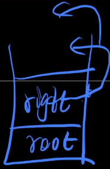

# 二叉树Binary-Tree与经典问题

## 二叉树基础知识

现实生活中树争着长的，计算机中的树倒着画的。

树和什么长得很像？ ————  链表

可以认为：链表是一种特殊的树型结构。如果一个结点有两个指针域，那么它就是二叉树。

### 二叉树

二叉树中的指针域有名字：左孩子、右孩子

**结点的度 ：结点下面有几个孩子就是度为几**

**二叉树性质：**

    1.每个结点的度最多为2。

    2.度为0的结点比度为2的结点多一个。

证明性质2： 

    n个结点的树有n - 1条边

    所以 点的数量 = 边的数量 + 1

    假设度为0的数量为n0，度为1的数量为n1,度为2的数量为n2。

    而度为1的结点下面有条边，度为2的结点下面为两条边。

    因此边的数量 = 0 + n1 + 2 * n2

    点的数量 = n0 + n1 + n2

    所以 n0 + n1 + n2 = n1 + 2 * n2 + 1

    化简得 ： n0 = n2 + 1

结论：

    所有二叉树中，只要得知叶子结点数量，即可求出度为2的结点数量。反之亦然。

遍历：

    重要的三种遍历方式：

        前序遍历： 根 左 右

        中序遍历： 左 根 右

        后序遍历： 左 右 根

三种遍历采取的都是递归思想来实现。

给出5分钟时间写出下图的三种遍历结果：


前序遍历：


中序遍历：


后序遍历：


其中，中序 + 前序 or 后序 是可以还原二叉树的。

    拿着前序 or 后序可以直接获取根结点，然后去中序中直接分割左右子树两部分。然后递归求解其左右子树。


代码演示二叉树：

```C++
#include <stdio.h>
#include <stdlib.h>
#include <time.h>

typedef struct Node {
    int key;
    struct Node *lchild, *rchild;
} Node;

Node* getNewNode(int key) {
    Node *p = (Node *)malloc(sizeof(Node));
    p->key = key;
    p->lchild = p->rchild = NULL;
    return p;
}

Node* random_insert(Node *root, int key) {
    if (root == NULL) return getNewNode(key);

    if (rand() % 2) {
        root->lchild = random_insert(root->lchild, key);
    } else {
        root->rchild = random_insert(root->rchild, key);
    }
    return root;
}

void pre_order(Node *root) {
    if (root == NULL) return ;
    printf("%d ", root->key);
    pre_order(root->lchild);
    pre_order(root->rchild);
}

void in_order(Node *root) {
    if (root == NULL) return ;
    in_order(root->lchild);
    printf("%d ", root->key);
    in_order(root->rchild);
}

int main(int argc, char *argv[]) {
    srand(time(0));
    if (argc != 2) return 0;
    // 输入要生成几个结点的二叉树
    int MAX_N = atoi(argv[1]);
    Node *root = NULL;
    for (int i = 1; i <= MAX_N; i++) {
        // 在二叉树中随机插入结点
        root = random_insert(root, i);
    }

    pre_order(root); printf("\n");
    in_order(root);  printf("\n");
    return 0;
}
```

然后手动推理一遍：


可以尝试推理长度为10的(5分钟)。

**基础二叉树概念：**

    完全二叉树：
    只有最后一层的右侧缺少结点的二叉树。在堆的性质中会利用到完全二叉数。

    满二叉树：
    没有度为1的结点的二叉树。

    完美二叉树：
    树是满的，不缺少结点。

错误版：


正确版：


**完全二叉树：**

父节点 与 子结点如果按照层进行编号，会有这样的关系：


有这种性质的好处是：

    普通二叉树需要两个指针域来记录地址，而完全二叉树不需要记录子树的地址。

    所以，可以节省大量的存储空间(节省存储边的空间)，可以通过父节点编号计算得到。

    这种属于计算式算法，节约空间。

    反之是记录式算法，节约时间。

    因为可以连续编号，所以可以用连续的存储空间存储完全二叉树，

    因此可以用数组存储完全二叉树。

通过这个例子体现出数据结构的优美之处：

    在代码中看似是个数组，但是在我们的思维中却是一个二叉树。体现出数据结构更多是对我们思维的训练。

### 关于树型结构的深入理解

思考结点和边的关系是什么？代表什么？有什么作用？

    树的结点：代表集合

    树的边：代表关系

    其中：

        父节点：代表全集

        子结点：各个子结点相加则为全集(父结点)，每个子结点性质互不相同。

集合问题最基础的从一堆元素中找一个元素(查找)。而树型结构通常应用场景就是查找。

**leetcode 145-二叉树的后序遍历**

后序遍历：左 右 根

二叉树遍历通常采用递归，利用系统栈。但是本题希望我们使用非递归————迭代的方式解题。

模拟系统栈：


处理左子树和左子树的左子树。



然后再处理右子树，最后处理root。

---

具体举个例子，弹栈表示输出：


    从1开始入栈，先访问左子树2入栈，

    再访问2的左子树4入栈，  // 0

    4没有左右结点，则访问根，也就是自己，输出4并且pop;

    再访问2的右子树5入栈， // 1

    5没有左右结点，则访问根，也就是自己，输出5并且pop;

    最后2访问根，         // 2
    
    也就是自己，输出2并且pop;


    再访问1的右子树3入栈，

    3没有左结点，访问右子树7入栈;

    7没有左右结点，则访问根，也就是自己，输出7并且pop;

    回到3,访问根，输出3并且pop;

    最后回到1,访问根，输出1并且pop;

    栈空结束。

---

对于递归的思路：

```C++
void post_order(Node *root) {
    if (root == NULL) return ;
    post_order(root->left);  // 0
    post_order(root->right); // 1
    output(root);            // 2
}
```

递归函数转非递归函数的方法：

开两个栈：
```C++
stack<TreeNode *> s1; // 记录当前处理的结点
stack<int> s2;        // 记录当前处理结点的递归状态
```
后面模拟递归流程即可。

```C++
/**
 * Definition for a binary tree node.
 * struct TreeNode {
 *     int val;
 *     TreeNode *left;
 *     TreeNode *right;
 *     TreeNode() : val(0), left(nullptr), right(nullptr) {}
 *     TreeNode(int x) : val(x), left(nullptr), right(nullptr) {}
 *     TreeNode(int x, TreeNode *left, TreeNode *right) : val(x), left(left), right(right) {}
 * };
 */
class Solution {
public:
    vector<int> postorderTraversal(TreeNode* root) {
        if (root == nullptr) return vector<int>(); // 空树
        vector<int> ans; // 保存出栈的结果的数组
        stack<TreeNode *> s1; // 递归过程中的局部变量,存相关结点的地址
        stack<int> s2;        // 递归到的程序位置，程序状态栈，记录递归运行到了什么程度
        s1.push(root);
        s2.push(0);
        while (!s1.empty()) {
            int status = s2.top(); // 根据s2的状态来判断当前该干啥
            s2.pop();
            switch (status) {
                case 0: { // push左子树
                    s2.push(1);

                    // 需不需要push左子树
                    if (s1.top()->left != nullptr) {
                        s1.push(s1.top()->left);
                        s2.push(0);
                    }
                } break;
                case 1: { // push右子树
                    s2.push(2);

                    // 需不需要push右子树
                    if (s1.top()->right != nullptr) {
                        s1.push(s1.top()->right);
                        s2.push(0);
                    }
                } break;
                case 2: { // 输出当前root
                    ans.push_back(s1.top()->val);
                    s1.pop();
                } break;
            }
        }
        return ans;
    }
};
```

**leetcode 331-验证二叉树的前序序列化**


问"9,3,4,#,#,1,#,#,2,#,6,#,#"这个序列是不是合法的前序遍历。

脑筋急转弯题，模拟递归过程，遍历到 # # 两个叶子结点，表示该回溯了。

比如4 # # 就可以抽象化为一个#，然后不断的寻找 X # #缩减成一个#：

    "9,3,#,1,#,#,2,#,6,#,#"

    "9,3,#,#,2,#,6,#,#"

    "9,#,2,#,6,#,#"

    "9,#,2,#,#"

    "9,#,#"

    "#"

最后能缩减成一个#，即为合法前序遍历序列，像消消乐一样。

```C++
class Solution {
public:
    bool isValidSerialization(string preorder) {
        vector<string> s; // 数组模拟栈，把过程中处理的字符串都存储到s中
        // j指向逗号，分隔逗号用
        for (int i = 0, j = 0; i < preorder.size(); i = j + 1) {
            j = i;
            while (j < preorder.size() && preorder[j] != ',') ++j; // 让j指向，字符
            s.push_back(preorder.substr(i, j - i));
            cout << s[s.size() - 1] << endl; // 拆出每一个数字字符
        }
        return 1;
    }
};
```

输出看下分割的效果。再然后缩减成一个#， 但是要考虑非法情况 # # # 是不能缩减的：


```C++
class Solution {
public:
    bool isValidSerialization(string preorder) {
        vector<string> s; // 数组模拟栈，把过程中处理的字符串都存储到s中
        // j指向逗号，分隔逗号用
        for (int i = 0, j = 0; i < preorder.size(); i = j + 1) {
            j = i;
            while (j < preorder.size() && preorder[j] != ',') ++j; // 让j指向，字符
            s.push_back(preorder.substr(i, j - i)); //切分数字部分
            // cout << s[s.size() - 1] << endl; // debug
            int last = s.size() - 1; // 倒着缩减
            while (s.size() >= 3 && s[last] == "#" 
            && s[last - 1] == "#" && s[last - 2] != "#") {
                s[last - 2] = "#";
                s.pop_back();
                s.pop_back();
                last = s.size() - 1; // 缩减后last长度会变，更新一下
            }
        }
        return s.size() == 1 && s[0] == "#";
    }
};
```

## 二叉树的作用

