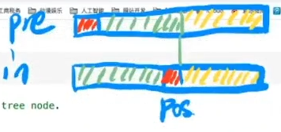
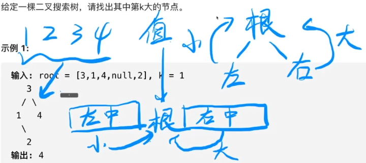
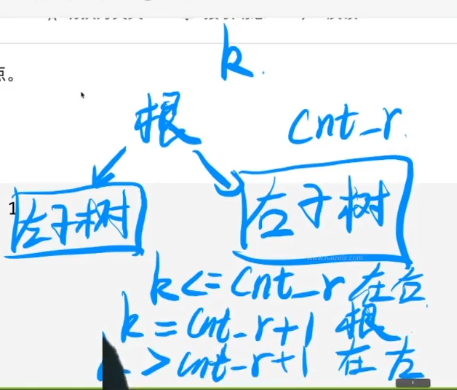
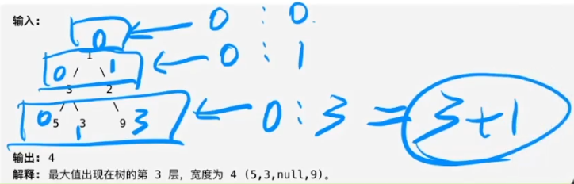
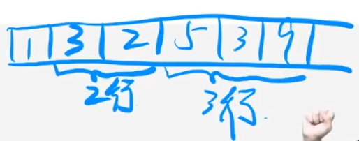
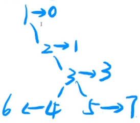
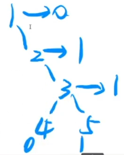
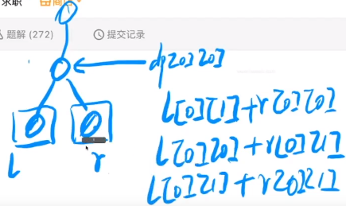

# 二叉树Binary-Tree与经典问题

## 二叉树基础知识

对于树形结构，如果有n个结点，那么一定有n-1条边。这是因为树是一种特殊的图，它满足以下条件：

1. **无环性**：树是一个无环连通图，即不存在闭合路径。
2. **连通性**：树中的任意两个结点都是连通的，即从图中任意一个结点出发，都能到达其他所有结点。

由于树是无环的，所以从任意一个结点到其他结点的路径是唯一的。如果我们从树的一个结点开始，沿着路径到达其他结点，每经过一个结点，就会增加一条边，直到到达最后一个结点。因此，对于n个结点的树，会有n-1条边，因为第一个结点不需要边来连接（它作为起点），而其他每个结点都通过一条边连接到树的其余部分。

这个性质是树结构的基本特性，也是为什么在许多算法和数据结构中树被广泛使用的原因之一。

---

现实生活中树争着长的，计算机中的树倒着画的。

树和什么长得很像？ ————  链表

可以认为：链表是一种特殊的树型结构。如果一个结点有两个指针域，那么它就是二叉树。

### 二叉树

二叉树中的指针域有名字：左孩子、右孩子

**结点的度 ：结点下面有几个孩子就是度为几**

**二叉树性质：**

    1.每个结点的度最多为2。

    2.度为0的结点比度为2的结点多一个。

证明性质2： 

    n个结点的树有n - 1条边

    所以 点的数量 = 边的数量 + 1

    假设度为0的数量为n0，度为1的数量为n1,度为2的数量为n2。

    而度为1的结点下面有条边，度为2的结点下面为两条边。

    因此边的数量 = 0 + n1 + 2 * n2

    点的数量 = n0 + n1 + n2

    所以 n0 + n1 + n2 = n1 + 2 * n2 + 1

    化简得 ： n0 = n2 + 1

结论：

    所有二叉树中，只要得知叶子结点数量，即可求出度为2的结点数量。反之亦然。

遍历：

    重要的三种遍历方式：

        前序遍历： 根 左 右

        中序遍历： 左 根 右

        后序遍历： 左 右 根

三种遍历采取的都是递归思想来实现。

给出5分钟时间写出下图的三种遍历结果：


前序遍历：


中序遍历：


后序遍历：


其中，中序 + 前序 or 后序 是可以还原二叉树的。

    拿着前序 or 后序可以直接获取根结点，然后去中序中直接分割左右子树两部分。然后递归求解其左右子树。


代码演示二叉树：

```C++
#include <stdio.h>
#include <stdlib.h>
#include <time.h>

typedef struct Node {
    int key;
    struct Node *lchild, *rchild;
} Node;

Node* getNewNode(int key) {
    Node *p = (Node *)malloc(sizeof(Node));
    p->key = key;
    p->lchild = p->rchild = NULL;
    return p;
}

Node* random_insert(Node *root, int key) {
    if (root == NULL) return getNewNode(key);

    if (rand() % 2) {
        root->lchild = random_insert(root->lchild, key);
    } else {
        root->rchild = random_insert(root->rchild, key);
    }
    return root;
}

void pre_order(Node *root) {
    if (root == NULL) return ;
    printf("%d ", root->key);
    pre_order(root->lchild);
    pre_order(root->rchild);
}

void in_order(Node *root) {
    if (root == NULL) return ;
    in_order(root->lchild);
    printf("%d ", root->key);
    in_order(root->rchild);
}

int main(int argc, char *argv[]) {
    srand(time(0));
    if (argc != 2) return 0;
    // 输入要生成几个结点的二叉树
    int MAX_N = atoi(argv[1]);
    Node *root = NULL;
    for (int i = 1; i <= MAX_N; i++) {
        // 在二叉树中随机插入结点
        root = random_insert(root, i);
    }

    pre_order(root); printf("\n");
    in_order(root);  printf("\n");
    return 0;
}
```

然后手动推理一遍：


可以尝试推理长度为10的(5分钟)。

**基础二叉树概念：**

    完全二叉树：
    只有最后一层的右侧缺少结点的二叉树。在堆的性质中会利用到完全二叉数。

    满二叉树：
    没有度为1的结点的二叉树。

    完美二叉树：
    树是满的，不缺少结点。

错误版：


正确版：


**完全二叉树：**

父节点 与 子结点如果按照层进行编号，会有这样的关系：


有这种性质的好处是：

    普通二叉树需要两个指针域来记录地址，而完全二叉树不需要记录子树的地址。

    所以，可以节省大量的存储空间(节省存储边的空间)，可以通过父节点编号计算得到。

    这种属于计算式算法，节约空间。

    反之是记录式算法，节约时间。

    因为可以连续编号，所以可以用连续的存储空间存储完全二叉树，

    因此可以用数组存储完全二叉树。

通过这个例子体现出数据结构的优美之处：

    在代码中看似是个数组，但是在我们的思维中却是一个二叉树。体现出数据结构更多是对我们思维的训练。

### 关于树型结构的深入理解

思考结点和边的关系是什么？代表什么？有什么作用？

    树的结点：代表集合

    树的边：代表关系

    其中：

        父节点：代表全集

        子结点：各个子结点相加则为全集(父结点)，每个子结点性质互不相同。

集合问题最基础的从一堆元素中找一个元素(查找)。而树型结构通常应用场景就是查找。

**leetcode 145-二叉树的后序遍历**

后序遍历：左 右 根

二叉树遍历通常采用递归，利用系统栈。但是本题希望我们使用非递归————迭代的方式解题。

模拟系统栈：


处理左子树和左子树的左子树。


然后再处理右子树，最后处理root。

---

具体举个例子，弹栈表示输出：


    从1开始入栈，先访问左子树2入栈，

    再访问2的左子树4入栈，  // 0

    4没有左右结点，则访问根，也就是自己，输出4并且pop;

    再访问2的右子树5入栈， // 1

    5没有左右结点，则访问根，也就是自己，输出5并且pop;

    最后2访问根，         // 2
    
    也就是自己，输出2并且pop;


    再访问1的右子树3入栈，

    3没有左结点，访问右子树7入栈;

    7没有左右结点，则访问根，也就是自己，输出7并且pop;

    回到3,访问根，输出3并且pop;

    最后回到1,访问根，输出1并且pop;

    栈空结束。

---

对于递归的思路：

```C++
void post_order(Node *root) {
    if (root == NULL) return ;
    post_order(root->left);  // 0
    post_order(root->right); // 1
    output(root);            // 2
}
```

递归函数转非递归函数的方法：

开两个栈：
```C++
stack<TreeNode *> s1; // 记录当前处理的结点
stack<int> s2;        // 记录当前处理结点的递归状态
```
后面模拟递归流程即可。

```C++
/**
 * Definition for a binary tree node.
 * struct TreeNode {
 *     int val;
 *     TreeNode *left;
 *     TreeNode *right;
 *     TreeNode() : val(0), left(nullptr), right(nullptr) {}
 *     TreeNode(int x) : val(x), left(nullptr), right(nullptr) {}
 *     TreeNode(int x, TreeNode *left, TreeNode *right) : val(x), left(left), right(right) {}
 * };
 */
class Solution {
public:
    vector<int> postorderTraversal(TreeNode* root) {
        if (root == nullptr) return vector<int>(); // 空树
        vector<int> ans; // 保存出栈的结果的数组
        stack<TreeNode *> s1; // 递归过程中的局部变量,存相关结点的地址
        stack<int> s2;        // 递归到的程序位置，程序状态栈，记录递归运行到了什么程度
        s1.push(root);
        s2.push(0);
        while (!s1.empty()) {
            int status = s2.top(); // 根据s2的状态来判断当前该干啥
            s2.pop();
            switch (status) {
                case 0: { // push左子树
                    s2.push(1);

                    // 需不需要push左子树
                    if (s1.top()->left != nullptr) {
                        s1.push(s1.top()->left);
                        s2.push(0);
                    }
                } break;
                case 1: { // push右子树
                    s2.push(2);

                    // 需不需要push右子树
                    if (s1.top()->right != nullptr) {
                        s1.push(s1.top()->right);
                        s2.push(0);
                    }
                } break;
                case 2: { // 输出当前root
                    ans.push_back(s1.top()->val);
                    s1.pop();
                } break;
            }
        }
        return ans;
    }
};
```

**leetcode 331-验证二叉树的前序序列化**


问"9,3,4,#,#,1,#,#,2,#,6,#,#"这个序列是不是合法的前序遍历。

脑筋急转弯题，模拟递归过程，遍历到 # # 两个叶子结点，表示该回溯了。

比如4 # # 就可以抽象化为一个#，然后不断的寻找 X # #缩减成一个#：

    "9,3,#,1,#,#,2,#,6,#,#"

    "9,3,#,#,2,#,6,#,#"

    "9,#,2,#,6,#,#"

    "9,#,2,#,#"

    "9,#,#"

    "#"

最后能缩减成一个#，即为合法前序遍历序列，像消消乐一样。

```C++
class Solution {
public:
    bool isValidSerialization(string preorder) {
        vector<string> s; // 数组模拟栈，把过程中处理的字符串都存储到s中
        // j指向逗号，分隔逗号用
        for (int i = 0, j = 0; i < preorder.size(); i = j + 1) {
            j = i;
            while (j < preorder.size() && preorder[j] != ',') ++j; // 让j指向，字符
            s.push_back(preorder.substr(i, j - i));
            cout << s[s.size() - 1] << endl; // 拆出每一个数字字符
        }
        return 1;
    }
};
```

输出看下分割的效果。再然后缩减成一个#， 但是要考虑非法情况 # # # 是不能缩减的：


```C++
class Solution {
public:
    bool isValidSerialization(string preorder) {
        vector<string> s; // 数组模拟栈，把过程中处理的字符串都存储到s中
        // j指向逗号，分隔逗号用
        for (int i = 0, j = 0; i < preorder.size(); i = j + 1) {
            j = i;
            while (j < preorder.size() && preorder[j] != ',') ++j; // 让j指向，字符
            s.push_back(preorder.substr(i, j - i)); //切分数字部分
            // cout << s[s.size() - 1] << endl; // debug
            int last = s.size() - 1; // 倒着缩减
            while (s.size() >= 3 && s[last] == "#" 
            && s[last - 1] == "#" && s[last - 2] != "#") {
                s[last - 2] = "#";
                s.pop_back();
                s.pop_back();
                last = s.size() - 1; // 缩减后last长度会变，更新一下
            }
        }
        return s.size() == 1 && s[0] == "#";
    }
};
```

## 二叉树的作用

### 作用1：理解高级数据结构的基础


堆、队列：需要不断的增加删除、维护最值。

森林结构“并查集”：解决连通性问题

(2-3树不讲)

这几类二叉排序树，通常情况下是作为各种语言标准库中重要的数据检索容器的底层实现。

比如：map set两个容器的底层实现是红黑树

文件系统不属于二叉排序树(位置放错了)

文件系统、数据库底层相关的数据结构：B树、B+树，也是一类平衡树（多叉树）

### 作用2：练习递归技巧的最佳选择


我们在接触递归的时候，更多的是想知道这个递归程序是不是正确的，而不是知道它是怎么运行的。

### 作用3：左孩子右兄弟表示法节省空间

任何树都可以转化为二叉树。


思考根节点会不会有右孩子？

会，表示是另一个树的根节点，也就是表示了森林。


下图是Alpha Go中的一段源代码的注释，描述一段存储棋盘的代码。正常用树表示肯定是100多叉树，但是在Alpha Go中是用二叉树存储（左孩子右兄弟）。


因为二叉树存储的边(指针域)更少，会极大的节约空间。


## 二叉树经典题-二叉树的基本操作

**leetcode 144-二叉树的前序遍历**

```C++
class Solution {
public:
    void pre_order(TreeNode* root, vector<int> &ans) {
        if (root == nullptr) return;
        ans.push_back(root->val);
        pre_order(root->left, ans);
        pre_order(root->right, ans);
    }
    vector<int> preorderTraversal(TreeNode* root) {
        vector<int> ans;
        pre_order(root, ans);
        return ans;
    }
};
```

**leetcode 589- N 叉树的前序遍历**


    vector<Node*> children;是给结点的边定义成了一个动态数组。

    前序遍历则先根，然后遍历边的数组即可。

```C++
class Solution {
public:
    void pre_order(Node* root, vector<int> &ans) {
        if (root == nullptr) return;
        ans.push_back(root->val);
        for (auto it = root->children.begin(); it != root->children.end(); it++) {
            pre_order(*it, ans);
        }
        // for (auto x : root->children) {
        //     pre_order(x, ans);
        // }
    }
    vector<int> preorder(Node* root) {
        vector<int> ans;
        pre_order(root, ans);
        return ans;
    }
};
```

**leetcode 226-翻转二叉树**

    1.先交换当前结点的左右两个子树
    2.再进行左子树的反转和右子树的反转


```C++
class Solution {
public:
    TreeNode* invertTree(TreeNode* root) {
        if (root == nullptr) return root;
        swap(root->left, root->right);
        invertTree(root->left);
        invertTree(root->right);
        return root;
    }
};
```

**leetcode 102. 二叉树的层序遍历**

    层序遍历，本题用BFS做。
    

```C++
class Solution {
public:
    vector<vector<int>> levelOrder(TreeNode* root) {
        vector<vector<int>> ans;
        if (root == nullptr)    return ans;
        
        queue<TreeNode *> que;
        que.push(root);
        int k = 0;
        while (!que.empty()) {
            ans.push_back(vector<int>());
            for (int i = que.size(); i > 0; i--) {
                TreeNode *tmp = que.front();
                que.pop();
                if (tmp->left)    que.push(tmp->left);
                if (tmp->right)   que.push(tmp->right);
                ans[k].push_back(tmp->val);
            }
            k++;
        }
        return ans;
    }
};
```

**leetcode 107. 二叉树的层序遍历II**

    与上一题的区别是本题是自底向上，在上一题的思路之上双指针交换即可。

    思考如何用dfs做？


    用dfs做，设置一个变量k表示当前在第几层，

    每一层用vector存，来新的元素push_back即可


```C++
class Solution {
public:
    // root是树，k是第几个数组，ans存结果
    void getResult (TreeNode* root, int k, vector<vector<int>> &ans) {
        if (root == nullptr) return;
        if (k == ans.size()) ans.push_back(vector<int>());
        ans[k].push_back(root->val);
        getResult(root->left, k + 1, ans);
        getResult(root->right, k + 1, ans);
    }

    vector<vector<int>> levelOrderBottom(TreeNode* root) {
        vector<vector<int>> ans;
        getResult(root, 0, ans);
        for (int i = 0, j = ans.size() - 1; i < j; i++, j--) {
            swap(ans[i], ans[j]);
        }
        return ans;
    }
};
```


**leetcode 103. 二叉树的锯齿形层序遍历**

    奇数行正常遍历、偶数行逆序遍历。

    1.先正常遍历结果
    2.然后把偶数行reverse


```C++
class Solution {
public:
    void getResult(TreeNode* root, int k, vector<vector<int>> &ans) {
        if (root == nullptr) return;
        if (k == ans.size()) ans.push_back(vector<int>());
        ans[k].push_back(root->val);
        getResult(root->left, k + 1, ans);
        getResult(root->right, k + 1, ans);
    }
    vector<vector<int>> zigzagLevelOrder(TreeNode* root) {
        vector<vector<int>> ans;
        getResult(root, 0, ans);
        for (int i = 1; i < ans.size(); i += 2) {
            reverse(ans[i].begin(), ans[i].end());
        }
        return ans;
    }
};
```

**以上题目为基础操作题**

## 二叉树经典题-二叉树的进阶操作


**leetcode 110. 平衡二叉排序树**

    平衡：每个节点的左子树和右子树的高度差不超过 1（这种限制确保了树的高度近似为 log(n)，其中 n 是树中节点的数量，这使得在平衡二叉树中进行插入、删除和搜索等操作的时间复杂度保持较低水平。）

通过一次递归遍历的做法：

    1.先写一个getHeight递归函数判断当前树高

```C++
int getHeight(TreeNode *root) {
    if (root == nullptr) return 0;
    int l = getHeight(root->left);
    int r = getHeight(root->right);
    return max(l, r) + 1;
}    
```

    2.基于这个方法，改写成判断树是否平衡
        让这个函数同时做两件事情：
            判断树高
            当树不平衡的时候返回一个负值
```C++
int getHeight(TreeNode *root) {
    if (root == nullptr) return 0;
    int l = getHeight(root->left);
    int r = getHeight(root->right);

    // 当树不平衡的时候返回一个负值
    if (l < 0 || r < 0) return -1; // 判断左右子树是否平衡
    if (abs(l - r) > 1) return -1; // 如果都平衡判断左右树高是否符合平衡条件

    return max(l, r) + 1;
}    
```
    3.如果getHeight(root)>=0，则为平衡二叉树。

```C++
class Solution {
public:
    int getHeight(TreeNode *root) {
        if (root == nullptr) return 0;
        int l = getHeight(root->left);
        int r = getHeight(root->right);
        if (l < 0 || r < 0) return -1;
        if (abs(l - r) > 1) return -1;
        return max(l, r) + 1;
    }
    bool isBalanced(TreeNode* root) {
        return getHeight(root) >= 0;
    }
};
```
本题技巧是设计递归函数的功能，不平衡返回负数。

**leetcode 112. 路径总和**

    题目大意：从根节点走到叶子结点是否有一条路径，使得路径上的结点之和等于targetSum

垃圾code：
```C++
class Solution {
public:
    void sum(TreeNode *root, int &s, const int &targetSum, bool &ans) {
        if (ans)     return;
        s += root->val;
        if (root->left == nullptr && root->right == nullptr && s == targetSum) {
            ans = 1;
            return;
        }
        if (root->left) sum(root->left, s, targetSum, ans);
        if (root->right) sum(root->right, s, targetSum, ans);
        s -= root->val;
    }

    bool hasPathSum(TreeNode* root, int targetSum) {
        if (root == nullptr) return 0;
        int s = 0;
        bool ans = 0;
        sum(root, s, targetSum, ans);
        return ans;
    }
};
```
优化：
```C++
class Solution {
public:
    bool hasPathSum(TreeNode* root, int targetSum) {
        if (root == nullptr) return false;
        if (!root->left && !root->right) return root->val == targetSum;
        if (root->left && hasPathSum(root->left, targetSum - root->val)) return true;
        if (root->right && hasPathSum(root->right, targetSum - root->val)) return true;
        return false;
    }
};
```
总结：

    if (!root->left && !root->right) return root->val == targetSum;
    是用于判断是否走到了叶子结点，如果走到叶子结点根据路径和是否满足targetSum的结果作为返回值，这个用来控制：

    if (root->left && hasPathSum(root->left, targetSum - root->val)) 
    if (root->right && hasPathSum(root->right, targetSum - root->val)) 

    这两个if只有找到了符合题意的路径才会return true

    return true和return false才是真正返回这个函数答案的地方。

**leetcode 105. 从前序与中序遍历序列构造二叉树**

    构造的过程肯定是递归的，
        先从前序中找到root，然后在中序中找到这个值，切分好左右子树
        然后两次递归恢复树，把树挂在root上

        1.找root
        2.递归建立左子树
        3.递归建立右子树  




```C++
class Solution {
public:
    TreeNode* buildTree(vector<int>& preorder, vector<int>& inorder) {
        if (preorder.size() == 0) return nullptr;
        int pos = 0; // 找根节点位置
        while (preorder[0] != inorder[pos]) pos++;
        // 从preorder和inorder中分割左右子树
        vector<int> l_pre, l_in, r_pre, r_in;
        for (int i = 0; i < pos; i++) {
            l_pre.push_back(preorder[i + 1]);
            l_in.push_back(inorder[i]);
        }
        for (int i = pos + 1; i < preorder.size(); i++) {
            r_pre.push_back(preorder[i]);
            r_in.push_back(inorder[i]);
        }
        // 构造二叉树
        TreeNode *root = new TreeNode(preorder[0]);
        root->left = buildTree(l_pre, l_in);
        root->right = buildTree(r_pre, r_in);
        return root;
    }
};
```
大量复制元素拖慢速度，优化一下(可以作为作业)：

    传递迭代器控制区间，避免复制元素提升速度。

```C++
class Solution {
public:
    TreeNode* build(vector<int>::iterator pre_arr, vector<int>::iterator in_arr, int n) {
        if (n == 0) return nullptr;
        int pos = 0;
        while (*pre_arr != *(in_arr + pos)) pos++;
        TreeNode *root = new TreeNode(*pre_arr);
        root->left = build(pre_arr + 1, in_arr, pos);
        root->right = build(pre_arr + pos + 1, in_arr + pos + 1, n - pos - 1);
        return root;
    }

    TreeNode* buildTree(vector<int>& preorder, vector<int>& inorder) {
        return build(preorder.begin(), inorder.begin(), preorder.size());
    }
};
```

**leetcode 222. 完全二叉树的节点个数**

    递归无脑做法：一个一个数，时间复杂度为O(n)

```C++
class Solution {
public:
    int countNodes(TreeNode* root) {
        if (root == nullptr) return 0;
        return countNodes(root->left) + countNodes(root->right) + 1;
    }
};
```

    二分查找 + 位运算可以优化为O(log^2 n)
        0.首先确定的是，最后一个叶子结点的编号就是结点总数，找到叶子结点的范围利用二分查找，找到最后一个元素的位置。
        1.先一直顺着左子树遍历到叶子结点，统计出树的层数
        2.利用完全二叉树的性质，可以算出叶子结点的编号范围，在次范围利用二分查找。
        3.使用二进制优化：
            第0层有一个二进制位
            第1层有两个二进制位
            第2层有三个二进制位
            第n层有2^(n - 1)个二进制位

            对于每一层的二进制位可以分析出该编号的结点在二叉树中的位置，
            比如：
                5的二进制是101，在第2层(0层开始)，最左边的1表示根节点，第二位的0表示5在根节点的左子树，第三位的1表示5在根结点的左子树的右子树。

                9的二进制是1000，在第三层，位置从根开始：
                根左左右就是9的位置

```C++
class Solution {
public:
    bool find(TreeNode *root, int h, int mid) {
        int bit = 1 << (h - 1); // 次高位开始判断左右，因为最高位表示根节点
        TreeNode *p = root;
        while (p && bit > 0) {
            if (mid & bit) {
                p = p->right; // 如果比对的位存在说明在右子树
            } else {
                p = p->left;
            }
            bit >>= 1;
        }
        return p != nullptr; // p不为空即p存在
    }
    int countNodes(TreeNode* root) {
        if (root == nullptr) return 0;
        int h = 0;
        TreeNode *p = root;
        while (p->left) h++, p = p->left; // 一直顺着左子树遍历到叶子结点，统计出树的层数
        int l = 1 << h, r = (1 << (h + 1)) - 1; 
        while (l < r) {
            // +1计算出的中点mid在右半部分，不然会l < r导致死循环
            int mid = (r - l + 1) / 2 + l;
            if (find(root, h, mid))     l = mid; // 找到说明在右半部分
            else    r = mid - 1;  // 没找到说明在左半部分
        }
        return l;
    }
};
```
**leetcode LCR 174. 寻找二叉搜索树中的目标节点**



    二叉搜索(排序)树：  右子树的值比根结点大，左子树的值比根结点小。  
    如果对二叉搜索树进行中序遍历：结果就是一个有序序列

    题目要求找到第k大的结点：
        右子树代表比根大的值，左子树代表比根小的值
        右 根 左的顺序找答案
        右子树的结点数量>=k，说明第k大的数在右子树。
        右子树结点数量+1=k，说明第k大的数在根
        右子树结点数量+1<k，说明第k大的数在左子树



```C++
class Solution {
public:
    int getConut(TreeNode *root) {
        if (root == nullptr) return 0;
        return getConut(root->left) + getConut(root->right) + 1;
    }
    int findTargetNode(TreeNode* root, int cnt) {
        int cnt_R = getConut(root->right);
        if (cnt <= cnt_R) return findTargetNode(root->right, cnt);
        if (cnt == cnt_R + 1) return root->val;
        return findTargetNode(root->left, cnt - cnt_R - 1); // 总结点数-右结点数-根结点
    }
};
```

    或者中序遍历取倒数k个：

```C++
class Solution {
public:
    void in_order(TreeNode *root, vector<int> &ans) {
        if (root == nullptr) return;
        in_order(root->left, ans);
        ans.push_back(root->val);
        in_order(root->right, ans);
        return;
    }
    int findTargetNode(TreeNode* root, int cnt) {
        vector<int> ans;
        in_order(root, ans);
        return ans[ans.size() - cnt];
    }
};
```
**leetcode LCR 143. 子结构判断**

    简单题，在A树(递归)寻找val与B树的根val相同的结点，然后一一比对看看是不是完全相同的子树，相同返回true，不同继续递归寻找。

```C++
class Solution {
public:
    // 检查以A和B为根节点的两棵树是否相等
    bool is_Match(TreeNode *A, TreeNode *B) {
        if (B == NULL) return true;  // B已经遍历完了
        if (A == NULL) return false; // A为空而B不为空，说明B的节点比A多
        if (A->val != B->val) return false;
        return is_Match(A->left, B->left) && is_Match(A->right, B->right);
    }
    bool isSubStructure(TreeNode* A, TreeNode* B) {
        if (B == NULL || A == NULL) return false;
        if (A->val == B->val && is_Match(A, B)) return true;
        return isSubStructure(A->left, B) || isSubStructure(A->right, B);
    }
};
```

**leetcode 662. 二叉树最大宽度**

    参考完全二叉树的性质，根结点编号为i，左孩子编号为2i，右孩子的编号为2i+1
    然后对树的根结点编号为0，顺着往下给每个结点都编号
    每层中从左到右差值最大值就是二叉树的最大宽度。



    如何求二叉树每行宽度的最大差值：利用队列，每次处理处理一行，求其编号的差值。



这里使用pair将结点和我们人为添加的编号进行绑定。

**新知识：std::pair**    
    
    std::pair 是 C++ 标准库中定义的一个模板类，用于将两个值组合成一个单元。它在很多情况下都非常有用，尤其是当你需要将两个不同类型的值作为一个单元来处理时。

    std::pair 包含两个公共成员变量 first 和 second，它们分别用于存储两个值。这两个值的类型可以是任意类型，包括基本类型、自定义类型、指针等。

可以把pair理解为一种结构体：
```C++
struct pair {
    T1 first;
    T2 second;
};
```


pair与map的关系：

    1.在 std::map 中，每个元素都是一个键值对，键和值之间的关系可以用 std::pair 来表示。
    2.std::pair 可以作为 std::map 的键值对的类型，用于表示 std::map 中的每个元素。
    3.在使用 std::map 时，通常会使用 std::pair 来构造每个键值对，然后将其插入到 std::map 中。


```C++
class Solution {
public:
    typedef pair<TreeNode *, int> PNI;
    int widthOfBinaryTree(TreeNode* root) {
        queue<PNI> q;
        q.push(PNI(root, 0));
        int ans = 0; // 打擂台求最大值
        while(!q.empty()) {
            int cnt = q.size(); // 记录上一层结点的个数
            int l = q.front().second, r; // 记录编号最小最大值

            for (int i = 0; i < cnt; i++) { // 下一行入队
                TreeNode *n = q.front().first;
                int ind = q.front().second;
                r = ind; // 更新编号最大值
                if (n->left) q.push(PNI(n->left, ind * 2));
                if (n->right) q.push(PNI(n->right, ind * 2 + 1));
                q.pop(); // 上一行出队
            }
            ans = max(ans, r - l + 1);
        }
        return ans;
    }
};
```

报错：爆int了
```C++
Line 27: Char 54: runtime error: signed integer overflow: 1073741824 * 2 cannot be represented in type 'int' (solution.cpp)
SUMMARY: UndefinedBehaviorSanitizer: undefined-behavior prog_joined.cpp:36:54
```

    自由尝试，可以改long long试试[Doge] 

原因：

    这样编号会导致编号的范围越来越大。
    每层以2^n的速度增长。



解决：

    如果将元素4的编号设置为0，元素5的编号设置为1.
    效果则是等价的。

    如何在不影响答案的前提下缩小编号范围是我们需要思考的。

    每个孩子的结点是根据父亲结点计算的，从减小父结点编号入手，
    如果一个树只有右子树没有左子树，可以考虑编号整体向左偏移到0；
    言外之意就是本行编号最小的结点是几就向左偏移几。
    

    优化编号(站在某个结点考虑它的左右孩子)：
    左孩子：(结点的编号-本行的最小编号)*2
    右孩子：(结点的编号-本行的最小编号)*2+1 



    题目明确说：题目数据保证答案将会在  32 位 带符号整数范围内。
     
但是

```C++
Line 28: Char 58: runtime error: signed integer overflow: 2147483644 * 2 cannot be represented in type 'int' (solution.cpp)
SUMMARY: UndefinedBehaviorSanitizer: undefined-behavior prog_joined.cpp:37:58
```

    *2还是会爆int，因为乘法会爆溢出，改用<<1，或者改unsigned int，AC。

```C++
class Solution {
public:
    typedef pair<TreeNode *, int> PNI;
    int widthOfBinaryTree(TreeNode* root) {
        queue<PNI> q;
        q.push(PNI(root, 0));
        int ans = 0; // 打擂台求最大值
        while(!q.empty()) {
            int cnt = q.size(); // 记录上一层结点的个数
            int l = q.front().second, r; // 记录编号最小最大值

            for (int i = 0; i < cnt; i++) { // 下一行入队
                TreeNode *n = q.front().first;
                int ind = q.front().second;
                r = ind; // 更新编号最大值
                // printf("l = %d, r = %d\n", l, r);
                if (n->left) q.push(PNI(n->left, (r - l) << 1));
                if (n->right) q.push(PNI(n->right, ((r - l) << 1) + 1));
                q.pop(); // 上一行出队
            }
            ans = max(ans, r - l + 1);
        }
        return ans;
    }
};
```

**leetcode 968. 监控二叉树**

其实不是二叉树的题，而是一个dp题。

    设计一个函数f(root) = dp[2][2]，返回4个值。

    第一个维度表示父结点是否放置摄像头；  [0/1]
    第二个维度表示当前结点是否放置摄像头  [0/1]

    则：
    dp[0][0]代表父节点不防止、本节点也不放置的这种情况下，想覆盖本节点所在的子树中所有节点的最少摄像头放置的数量。 



    