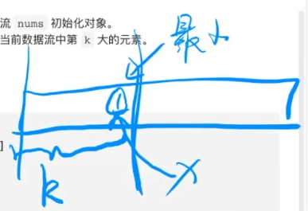
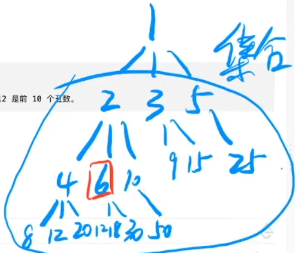
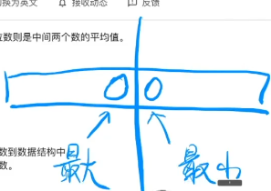
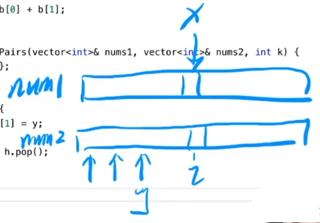

# 堆与优先队列

## 堆的基础知识

### 完全二叉树回顾

回顾完全二叉树，与堆之间非常暧昧


完全二叉树可以用连续的数组空间进行存储，因为完全二叉树中父节点与子节点的编号是有关系的。因为子节点的编号可以通过父节点的编号计算得到，所以完全二叉树就没有必要存储边的信息。

    父节点i从1开始：
        左孩子：2i
        右孩子：2i + 1

    （从1标号的好处，每一层最右边的元素值都是二进制位数满的状态，1、3、7、15等）

    父节点i从0开始：（数组元素下标从0开始）
        左孩子：2i + 1
        右孩子：2i + 2 

思维上是完全二叉树，但是实际代码实现是一个数组，我们要看着数组把他想成完全二叉树

**练习看着数组(右图)画出完全二叉树(左图) 5min**


### 堆


    堆：一种基于完全二叉树的数据结构。

    堆的性质：任意的三元组（父节点与其两个子节点）
        如果所有父节点都大于两个子节点，则是大顶堆，堆顶元素则是最大值。
        如果所有父节点都小于两个子节点，则是小顶堆，堆顶元素则是最小值。

    所以大顶堆的最大值一定在树根，小顶堆的最小值也一定在树根。

    那么，大顶堆中，
    Q:第二大的值在哪里？
    A:第二层

    Q:第三大的值在哪里？
    A:第二层或者第三层

因为只有父子之间才有明确的大小关系、兄弟之间是没有的。

在第三层的节点从性质上肯定得出一定会用两个元素大于第三层的节点。

    所有第三层的点都有可能是第三大的值，比如：


    第四大的值则第四大的值可能在2、3、4层： 


    第五大的值可能在2、3、4、5层，以此类推...

小顶堆性质雷同


### 堆--尾部插入调整


插入元素肯定是在数组的末尾添加，但是添加以后有可能会违反堆的性质，需要进行插入调整：

    每次都（通过数组下标计算出父节点的编号）跟当前的爹(父节点)比，如果比父节点大，则swap(我，父节点)（成为新的爸爸），直到成为整个树的根节点或者遇到比自己大的父节点。 (向上调整)


    直到符合堆的性质为止


**强化数据结构的概念理解：结构定义+结构操作**

用堆来举例子

    结构定义：堆是基于完全二叉树的，所以它是一种树型结构
    结构定义还包含性质：任意三元组，根要比其左右节点大（或小）

    结构操作：堆基本操作插入、删除
    但是重点需要关注的是如何维护这个数据结构的性质

所以，数据结构做的事情一句话概括：
    定义一种性质，维护这种性质。（数据结构的精髓）

### 堆--头部弹出调整

    弹出的是堆顶元素


    弹出后，有效元素从10个变成9个，元素7位置越界，将其调整到堆顶，然后进行向下调整


    寻找当前三元组的最大(小)值，然后将父节点与其交换，直到满足堆的性质为止。


### 堆排序


假设对上图的数组进行从小到大排序，要建立一个大顶堆。

    为什么要建立大顶堆而不是小顶堆？

    因为堆弹出堆顶元素时，数组的尾部会减少元素，那么如果弹出的元素恰好是最大值，那么正好可以在同一个数组完成堆排序，所以使用大顶堆。
---

**练习：**

    画出图上数组弹出一次以后的堆以及数组
    画出图上数组弹出三次以后的堆以及数组    


<center></center>
<center><br>弹一次</br></center>
<br></br>


<center></center>
<center><br>弹三次</br></center>
<br></br>

通过这个练习，能意识到所谓的堆，在程序中就是一段连续的数组空间。这是需要形成的思维映射

### 堆——优先队列


堆通常有一个额外的名字叫做优先队列，

严谨来说，优先队列通常情况下是用堆来实现的。

    为什么我们会把堆和队列的概念联系在一起呢?

    回顾一下
    堆是从哪进元素（数组末尾）
    堆是从哪出元素（数组头部）

    出入元素的性质符合队列的性质，都是尾入头出。
    但是，堆不是一个普通的队列，出堆的元素永远是数组中的最大/最小值。
    如果把最值当成当成是元素的优先级的话，那么每次出队的元素就是当前队列中优先级最高的元素。我们管这种队列称之为优先队列。

    所以实际的代码实现上，优先队列是一维的数组结构，但是在思维逻辑上是二维的树型结构。

    堆是优先队列的一种实现方式。


### 一句话理解：堆

    堆适合维护：集合最值

    现在说到堆，脑子里不论映射出一个数组的样子还是一个完全二叉树的样子，这都只是停留在堆是怎么实现的层面。

    但是论解决问题的角度，我们不在乎堆是怎么实现的，只要能记住，它适合处理集合最值的问题。

## 堆的代码演示

[点击跳转heap.cpp](heap.cpp)

## 堆的经典题目-堆的基本操作

**leetcode LCR 159. 库存管理 III**

两个思路：

    1.建立一个空的大顶堆，然后遍历arr不断的往堆里push，当堆中元素数量超过cnt个时pop。这样遍历完以后堆里存的就是cnt小的数。

    2.在arr的基础上建立一个小根堆（排序），然后取前cnt个元素存到新的vector中return

---

代码1：思路1的方式，需要push_heap、pop_heap

[push_heap、pop_heap等代码演示](heap_algorithms.cpp)

```C++
class Solution {
public:
    vector<int> inventoryManagement(vector<int>& stock, int cnt) {
        vector<int> heap;
        for (auto x : stock) {
            heap.push_back(x);
            push_heap(heap.begin(), heap.end(), less<int>());
            if (heap.size() > cnt) {
                pop_heap(heap.begin(), heap.end(), less<int>());
                heap.pop_back();
            }
        }
        return heap;
    }
};
```
缺点：编码麻烦，但是保证返回的是vector

---

代码2：还是思路1的方式，但是用的是优先队列priority_queue

[priority_queue演示](priority_queue_example.cpp)

```C++
class Solution {
public:
    vector<int> inventoryManagement(vector<int>& stock, int cnt) {
        priority_queue<int> heap;  // 大根堆
        for (auto x : stock) {
            heap.push(x);
            if (heap.size() > cnt)    heap.pop();
        }
        
        std::vector<int> result;
        while (!heap.empty()) {
            result.push_back(heap.top());
            heap.pop();
        }
        // std::reverse(result.begin(), result.end());  // 将结果反转，以符合堆的顺序
        return result;
    }
};
```

代码3：思路2的方式，用优先队列实现

```C++
class Solution {
public:
    vector<int> inventoryManagement(vector<int>& stock, int cnt) {
        // 创建一个最小堆
        priority_queue<int, vector<int>, greater<int>> min_heap(stock.begin(), stock.end());

        // 取出最小的 cnt 个元素
        vector<int> result;
        for (int i = 0; i < cnt; i++) {
            result.push_back(min_heap.top());
            min_heap.pop();
        }

        return result;
    }
};
```

代码4：自己封装Heap方法

[封装Heap讲解](CPP_heap.cpp)

```C++
class Heap {
public:
    vector<int> heap;
    function<bool(int, int)> cmp;
    
    // 构造函数，接受一个比较函数
    Heap(function<bool(int, int)> cmp) : cmp(cmp) {}

    int top() {
        if (!empty())     return heap[0];
        cerr << "Error: top from an empty heap" << endl;
        return INT32_MIN;
    }
    
    bool empty() {return heap.empty();}
    
    int size() {return heap.size();}
    
    void push(int x) {
        heap.push_back(x);
        push_heap(heap.begin(), heap.end(), cmp);
    }
    
    void pop() {
        if (!empty()) {
            pop_heap(heap.begin(), heap.end(), cmp);
            heap.pop_back();
        } else {
            cerr << "Error: pop from an empty heap" << endl;
        }
    }
    
    vector<int> getHeap() {
        return heap;
    }
};

class Solution {
public:
    vector<int> inventoryManagement(vector<int>& stock, int cnt) {
        Heap h{less<int>()};  // 小顶堆，值越大优先级越小
        for (auto x : stock) {
            h.push(x);
            if (h.size() > cnt) h.pop();
        }
        // 将堆中的元素转换为向量并返回
        return h.getHeap();
    }
};

```
缺点：速度慢，但重点是建立封装堆的思维。以及理解堆擅长解决的问题。

---

**leetcode 1046. 最后一块石头的重量**

很明显堆的题目：一个石头集合，每次取出最大值和次大值，相等则都没了，不相等做差继续扔在大顶堆内。

```C++
class Heap {
public:
    vector<int> heap;
    // cmp 是一个成员变量，用于存储一个函数对象
    function<bool(int, int)> cmp; // 函数原型bool operator()(const _Tp& __x, const _Tp& __y) const
    
    // 构造函数，接受一个比较函数
    Heap(function<bool(int, int)> cp) : cmp(cp) {}

    int top() {
        if (!empty())     return heap[0];
        cerr << "Error: top from an empty heap" << endl;
        return INT32_MIN;
    }
    
    bool empty() {return heap.empty();}
    
    int size() {return heap.size();}
    
    void push(int x) {
        heap.push_back(x);
        push_heap(heap.begin(), heap.end(), cmp);
    }
    
    void pop() {
        if (!empty()) {
            pop_heap(heap.begin(), heap.end(), cmp);
            heap.pop_back();
        } else {
            cerr << "Error: pop from an empty heap" << endl;
        }
    }

    vector<int> getHeap() {
        return heap;
    }
};

class Solution {
public:
    int lastStoneWeight(vector<int>& stones) {
        Heap h{less<int>()};
        for (auto x : stones) {
            h.push(x);
        }
        while (h.size() > 1) {
            int y = h.top(); h.pop();
            int x = h.top(); h.pop();
            if (x == y) continue;
            h.push(y - x);
        }
        if (h.size() == 0) return 0;
        return h.top();
    }
};
```

脑子里想的不是数组、完全二叉树，而是维护一个集合的最大值，集合自动帮助我们维护最大值。堆的妙用。从维护集合最值的角度去思考问题。什么样的数据结构适合解决什么问题。

---

**leetcode 703. 数据流中的第 K 大元素**



我们假设把数据进行排序从大到小，根据第k大的数把整个数据划分成两个集合。左边的是前k大的数的集合，这个集合中最后的元素就是第K大的元素。

所以我们可以考虑把这个集合维护成一个小顶堆，堆顶元素就是当前集合的第k大元素。

题目额外还需要我们实现构造函数(第k大的数 ， 数组)，所以创建这个对象的时候我们同时就维护一个小顶堆，容量为k，每次add以后，谁小谁出去。则堆顶始终是ans。正好作为add函数的return

```C++
class KthLargest {
private:
    priority_queue<int, vector<int>, greater<int>> minHeap;
    int k;

public:
    KthLargest(int k, vector<int>& nums) : k(k) {
        for (auto x : nums) {
            add(x);
        }
    }

    int add(int val) {
        minHeap.push(val);
        if (minHeap.size() > k) {
            minHeap.pop();
        }
        return minHeap.top();
    }
};
// class KthLargest {
// public:
//     class Heap {  // 内部类
//     public:
//         vector<int> heap;
//         // cmp 是一个成员变量，用于存储一个函数对象
//         function<bool(int, int)> cmp; // 函数原型bool operator()(const _Tp& __x, const _Tp& __y) const
        
//         // 构造函数，接受一个比较函数
//         Heap(function<bool(int, int)> cp) : cmp(cp) {}

//         int top() {
//             if (!empty())     return heap[0];
//             cerr << "Error: top from an empty heap" << endl;
//             return INT32_MIN;
//         }
        
//         bool empty() {return heap.empty();}
        
//         int size() {return heap.size();}
        
//         void push(int x) {
//             heap.push_back(x);
//             push_heap(heap.begin(), heap.end(), cmp);
//         }
        
//         void pop() {
//             if (!empty()) {
//                 pop_heap(heap.begin(), heap.end(), cmp);
//                 heap.pop_back();
//             } else {
//                 cerr << "Error: pop from an empty heap" << endl;
//             }
//         }

//         vector<int> getHeap() {
//             return heap;
//         }
//     };

//     Heap h{greater<int>()};
//     int kk;  // 第k大计数

//     KthLargest(int k, vector<int>& nums) : kk(k){
//         for (auto x : nums) {
//             add(x);
//         }
//     }   
    
//     int add(int val) {
//         h.push(val);
//         if (h.size() > kk) h.pop();
//         return h.top();
//     }
// };
```
---

**leetcode 215. 数组中的第K个最大元素**

找第k大值，还是想象一个 逆序 序列，取前长度k为一个集合(堆)，比集合中最小值大才能进去，小的值会被不断的挤出来 ——> 小顶堆

和上一道题大同小异，还是维护一个小顶堆。维护的是前k大的最小值，没什么说的

```C++
class Solution {
public:
    int findKthLargest(vector<int>& nums, int k) {
        // 创建一个小顶堆，大小为 k
        priority_queue<int, vector<int>, greater<int>> minHeap;
        
        // 遍历数组中的每个元素
        for (int num : nums) {
            minHeap.push(num); // 将元素添加到堆中
            // 如果堆的大小超过 k，则删除堆顶元素
            if (minHeap.size() > k) {
                minHeap.pop();
            }
        }
        
        // 此时，堆顶元素即为第 k 个最大的元素
        return minHeap.top();
    }
};
```
---

**leetcode 264. 丑数II**

我们通过1开始，手动的生成其2、3、5的倍数，构成一个集合，将其构成小顶堆。

要第几个丑数，则循环几次。每次以堆顶值来入队（手动的生成其2、3、5的倍数）；然后pop堆顶，这样始终堆顶就是前n小的丑数。




构成丑数集合的这个数时，不是入队每个数的2、3、5倍数，需要剪枝：某数只能乘以比当前数最大的素因子还大的素因子来剪枝。（图中将到3时候，3x2以及被2x3枚举过了，需要剪枝）

```C++
class Solution {
public:
    int nthUglyNumber(int n) {
        // 使用最小堆存储丑数
        priority_queue<long, vector<long>, greater<long>> pq;
        
        // 初始丑数1
        pq.push(1);
        long ans = 0;
        
        while (n--) {
            // 获取当前最小丑数
            ans = pq.top();
            pq.pop();
            
            // 避免重复丑数，只有当当前最小值出队时才插入新的丑数
            if (ans % 5 == 0) {
                pq.push(ans * 5);
            } else if (ans % 3 == 0) {
                pq.push(ans * 5);
                pq.push(ans * 3);
            } else {
                pq.push(ans * 5);
                pq.push(ans * 3);
                pq.push(ans * 2);
            }
        }
        return ans;
    }
};
```
---

**leetcode 295. 数据流的中位数**


随机给值，维护有序序列的中位数。

因为要维护一堆元素的中位数，假如给一个有序数组，中位数是在数组中间的位置。

那么在这个中间的位置，往左边看能看到左半区间的最大值，往右看能看到右半区间的最小值。

所谓的中位数就是左右区间长度相同时，中间就是中位数(等会考虑奇偶)。

所以后半段是小顶堆，前半段是大顶堆。这样就可以维护中间的中位数。

所以如果前半段多，则往后半段塞，反之亦然。

这就是对顶堆结构。

然后考虑新来元素往前半段塞还是往后半段塞： 跟前半段的堆顶(最大值比)。

如果比最大值小，则塞前半段； 否则塞后半段。

插入完以后调整两边的长度。

(无序的不能用前后队列，队列也不能中间插入)



```C++
class MedianFinder {
public:
    priority_queue<int> maxHeap;
    priority_queue<int, vector<int>, greater<int>> minHeap;

    MedianFinder() {

    }
    
    void addNum(int num) {
        // 如果num比前半段最大值小，则塞前半段； 否则塞后半段。
        if (maxHeap.empty() || num <= maxHeap.top()) {
            maxHeap.push(num);
        } else {
            minHeap.push(num);
        }

        // 调整两边的元素数量：
        // 定义前半段 最多比 后半段，元素多一个。
        
        // 如果后半段比前半段多，后半段给前半段一个元素
        if (minHeap.size() > maxHeap.size()) {
            maxHeap.push(minHeap.top());
            minHeap.pop();
        }
        // 如果前半段比后半段多2，前半段给后半段一个元素
        if (maxHeap.size() == minHeap.size() + 2) {
            minHeap.push(maxHeap.top());
            maxHeap.pop();
        }
        return ;
    }
    
    double findMedian() {
        int n = maxHeap.size() + minHeap.size();
        // 如果元素个数是奇数个，则中位数就是maxHeap.top()
        if (n % 2 == 1) {
            return maxHeap.top();
        }
        // 否则是偶数个 ，中位数是两个堆顶 / 2
        return 1.0 * (maxHeap.top() + minHeap.top()) / 2;
    }
};

/**
 * Your MedianFinder object will be instantiated and called as such:
 * MedianFinder* obj = new MedianFinder();
 * obj->addNum(num);
 * double param_2 = obj->findMedian();
 */

```


---

## 堆的经典题目-堆的进阶操作


**leetcode 373. 查找和最小的 K 对数字**

找两个有序数组中，和最小的k对数字。其中一个数字来自第一个数组，另一个数字来自第二个数组。

假设有一个方法能枚举一对儿数字组成一个集合，现在想求出最小的前k对数字(维护前k小)，要小，谁大谁滚，大顶堆。

要把Heap类中int改成vector<int> 麻烦，改用模板类

```C++
// class Solution {
// public:
//     class Heap {
//     public:
//         vector<vector<int>> heap;
//         function<bool(const vector<int>&, const vector<int>&)> cmp;

//         Heap(function<bool(const vector<int>&, const vector<int>&)> cp) : cmp(cp) {}

//         vector<int> top() {
//             if (!empty()) return heap[0];
//             cerr << "Error: top from an empty heap" << endl;
//             return vector<int>(2, INT32_MIN);
//         }

//         bool empty() { return heap.empty(); }

//         int size() { return heap.size(); }

//         void push(const vector<int>& x) {
//             heap.push_back(x);
//             push_heap(heap.begin(), heap.end(), cmp);
//         }

//         void pop() {
//             if (!empty()) {
//                 pop_heap(heap.begin(), heap.end(), cmp);
//                 heap.pop_back();
//             } else {
//                 cerr << "Error: pop from an empty heap" << endl;
//             }
//         }

//         vector<vector<int>> getHeap() {
//             return heap;
//         }
//     };

//     struct CMP {
//         bool operator()(const vector<int>& a, const vector<int>& b) {
//             return a[0] + a[1] < b[0] + b[1];
//         }
//     };

//     vector<vector<int>> kSmallestPairs(vector<int>& nums1, vector<int>& nums2, int k) {
//         CMP less_than;
//         Heap h(less_than);
//         vector<int> tmp(2);
//         for (auto x : nums1) {
//             for (auto y : nums2) {
//                 tmp[0] = x, tmp[1] = y;
//                 if (h.size() < k || less_than(tmp, h.top())) {
//                     h.push(tmp);
//                     if (h.size() > k) h.pop();
//                 } else {
//                     break;
//                 }
//             }
//         }
//         return h.getHeap();
//     }
// };
```
暴力枚举肯定超时，因为没利用两个数组是有序数组的性质。

x固定后，不断的和y配对成一对儿序列往堆里放，

假如到位置i以后，不能放到堆里，那么i后面的都没必要放。



```C++
class Solution {
public:
    template<typename T>
    class heap : public vector<T> {  // 继承vector<T>的公共接口
    public:
        // 模板(构造)函数
        template<typename Func_T>
        heap(Func_T cmp) : cmp(cmp) {} 

        void push(const T &a) { // &引用而不是拷贝，节约开销，const防止a的值被修改
            this->push_back(a);
            push_heap(this->begin(), this->end(), cmp);
        }

        void pop() {
            pop_heap(this->begin(), this->end(), cmp);
            this->pop_back();
        }

        T &top() { // &引用，可访问、修改堆顶。不加&只能访问一个拷贝值，不能修改
            return this->at(0);
        }

    // private:
        function<bool(T&, T&)> cmp; // 相当于函数指针
    };

    // 手动写比较规则，大顶堆是小于号
    struct CMP {  
        bool operator()(const vector<int>& a,const vector<int>& b) {
            return a[0] + a[1] < b[0] + b[1];
        }
    };

    vector<vector<int>> kSmallestPairs(vector<int>& nums1, vector<int>& nums2, int k) {
        CMP less_than; // 定义一个比较对象
        // 堆中的元素是长度为2的vector，数组中的两位分别代表数组中的第一个值和第二个值
        heap<vector<int>> h{less_than};
        vector<int> tmp(2);
        for (auto x : nums1) { // 暴力枚举，肯定超时
            for (auto y : nums2) {
                tmp[0] = x, tmp[1] = y;

                // 优化
                if (h.size() < k || less_than(tmp, h.top())) { // 堆未满k个元素或满k后tmp比当前堆顶小时
                    h.push(tmp);
                    if (h.size() > k) h.pop();
                } else {
                    break;
                }
            }
        }
        return h;
    }
};
```

---


**leetcode 313. 超级丑数**

上一题素因子列表只有2、3、5，本题给了一个列表素因子用来生成丑数。
参考之前的做法：

    先定义长度为prime.size()的一维数组当作指针, 指向相关的丑数相关的位置。 
    然后再定义一个数组data，把第一个元素1先存到数组里。


```C++
/*
这段代码解决的问题是找到第 n 个超级丑数，其中超级丑数定义为其所有质因数都在给定的质数数组 primes 中。

解题思路：
数据初始化：

首先定义一个 vector<unsigned int> p，用于记录每个质数在当前超级丑数序列 data 中的倍数索引。
定义 vector<unsigned int> data 来存储生成的超级丑数序列，初始值为 [1]，因为 1 是第一个超级丑数。
主循环：

使用 while (data.size() != n) 循环，直到 data 中包含了第 n 个超级丑数。
生成下一个超级丑数 ans：

初始化 ans 为 primes[0] * data[p[0]]，即第一个质数乘以 data 中第一个质数倍数。
寻找最小的超级丑数：

使用循环遍历所有质数，更新 ans 为所有质数乘以其倍数的最小值，即 ans = min(ans, primes[i] * data[p[i]])。
更新倍数索引：

再次循环遍历所有质数，找到使得乘积等于 ans 的质数倍数，并将对应的倍数索引 p[i] 加一，以准备生成下一个超级丑数。
将生成的超级丑数加入序列：

将 ans 添加到 data 中，作为下一个超级丑数。
返回结果：

当 while 循环结束后，data 中的最后一个元素即为第 n 个超级丑数，将其返回。
总结：
这段代码通过使用多指针技术，即 p 数组来记录每个质数在当前超级丑数序列中的倍数索引，不断生成并比较可能的超级丑数，直到找到第 n 个超级丑数为止。每次循环中，通过更新 p 数组和生成新的超级丑数来逐步扩展 data 序列，最终返回第 n 个超级丑数。
*/

class Solution {
public:
    // 函数用于找到第 n 个超级丑数，给定 n 和质数数组 primes
    int nthSuperUglyNumber(int n, vector<int>& primes) {
        // 用于保存每个质数的索引位置
        vector<unsigned int> p(primes.size());
        // 用于存储超级丑数序列
        vector<unsigned int> data;
        // 起始的超级丑数是 1
        data.push_back(1);
        // 初始化变量用于存储当前的超级丑数
        unsigned int ans = 1;
        // 继续直到找到第 n 个超级丑数
        while (data.size() != n) {
            // 计算下一个可能的超级丑数
            ans = primes[0] * data[p[0]];
            // 找出所有质数的倍数中的最小超级丑数
            for (int i = 1; i < primes.size(); i++) {
                ans = min(ans, primes[i] * data[p[i]]);
            }
            // 增加倍数索引，如果乘积等于当前超级丑数
            for (int i = 0; i < primes.size(); i++) {
                if (primes[i] * data[p[i]] == ans) p[i]++;
            }
            // 将找到的超级丑数存入序列中
            data.push_back(ans);
        }
        // 返回第 n 个超级丑数
        return ans;
    }
};

```

## 哈夫曼编码