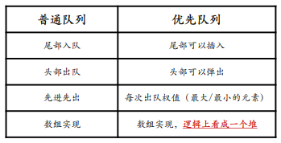

# 堆与优先队列

## 堆的基础知识

### 完全二叉树回顾

回顾完全二叉树，与堆之间非常暧昧


完全二叉树可以用连续的数组空间进行存储，因为完全二叉树中父节点与子节点的编号是有关系的。因为子节点的编号可以通过父节点的编号计算得到，所以完全二叉树就没有必要存储边的信息。

    父节点i从1开始：
        左孩子：2i
        右孩子：2i + 1

    （从1标号的好处，每一层最右边的元素值都是二进制位数满的状态，1、3、7、15等）

    父节点i从0开始：（数组元素下标从0开始）
        左孩子：2i + 1
        右孩子：2i + 2 

思维上是完全二叉树，但是实际代码实现是一个数组，我们要看着数组把他想成完全二叉树

**练习看着数组(右图)画出完全二叉树(左图) 5min**


### 堆


    堆：一种基于完全二叉树的数据结构。

    堆的性质：任意的三元组（父节点与其两个子节点）
        如果所有父节点都大于两个子节点，则是大顶堆，堆顶元素则是最大值。
        如果所有父节点都小于两个子节点，则是小顶堆，堆顶元素则是最小值。

    所以大顶堆的最大值一定在树根，小顶堆的最小值也一定在树根。

    那么，大顶堆中，
    Q:第二大的值在哪里？
    A:第二层

    Q:第三大的值在哪里？
    A:第二层或者第三层

因为只有父子之间才有明确的大小关系、兄弟之间是没有的。

在第三层的节点从性质上肯定得出一定会用两个元素大于第三层的节点。

    所有第三层的点都有可能是第三大的值，比如：


    第四大的值则第四大的值可能在2、3、4层： 


    第五大的值可能在2、3、4、5层，以此类推...

小顶堆性质雷同


### 堆--尾部插入调整


插入元素肯定是在数组的末尾添加，但是添加以后有可能会违反堆的性质，需要进行插入调整：

    每次都（通过数组下标计算出父节点的编号）跟当前的爹(父节点)比，如果比父节点大，则swap(我，父节点)（成为新的爸爸），直到成为整个树的根节点或者遇到比自己大的父节点。 (向上调整)


    直到符合堆的性质为止


**强化数据结构的概念理解：结构定义+结构操作**

用堆来举例子

    结构定义：堆是基于完全二叉树的，所以它是一种树型结构
    结构定义还包含性质：任意三元组，根要比其左右节点大（或小）

    结构操作：堆基本操作插入、删除
    但是重点需要关注的是如何维护这个数据结构的性质

所以，数据结构做的事情一句话概括：
    定义一种性质，维护这种性质。（数据结构的精髓）

### 堆--头部弹出调整

    弹出的是堆顶元素


    弹出后，有效元素从10个变成9个，元素7位置越界，将其调整到堆顶，然后进行向下调整


    寻找当前三元组的最大(小)值，然后将父节点与其交换，直到满足堆的性质为止。


### 堆排序


假设对上图的数组进行从小到大排序，要建立一个大顶堆。

    为什么要建立大顶堆而不是小顶堆？

    因为堆弹出堆顶元素时，数组的尾部会减少元素，那么如果弹出的元素恰好是最大值，那么正好可以在同一个数组完成堆排序，所以使用大顶堆。
---

**练习：**

    画出图上数组弹出一次以后的堆以及数组
    画出图上数组弹出三次以后的堆以及数组    


<center></center>
<center><br>弹一次</br></center>
<br></br>


<center></center>
<center><br>弹三次</br></center>
<br></br>

通过这个练习，能意识到所谓的堆，在程序中就是一段连续的数组空间。这是需要形成的思维映射

### 堆——优先队列



堆通常有一个额外的名字叫做优先队列，

严谨来说，优先队列通常情况下是用堆来实现的。

    为什么我们会把堆和队列的概念联系在一起呢?

    回顾一下
    堆是从哪进元素（数组末尾）
    堆是从哪出元素（数组头部）

    出入元素的性质符合队列的性质，都是尾入头出。
    但是，堆不是一个普通的队列，出堆的元素永远是数组中的最大/最小值。
    如果把最值当成当成是元素的优先级的话，那么每次出队的元素就是当前队列中优先级最高的元素。我们管这种队列称之为优先队列。

    所以实际的代码实现上，优先队列是一维的数组结构，但是在思维逻辑上是二维的树型结构。

    堆是优先队列的一种实现方式。


### 一句话理解：堆

    堆适合维护：集合最值

    现在说到堆，脑子里不论映射出一个数组的样子还是一个完全二叉树的样子，这都只是停留在堆是怎么实现的层面。

    但是论解决问题的角度，我们不在乎堆是怎么实现的，只要能记住，它适合处理集合最值的问题。

## 堆的代码演示

[点击跳转heap.cpp](heap.cpp)

## 堆的经典题目-堆的基本操作

**leetcode LCR 159. 库存管理 III**

两个思路：

    1.建立一个空的大顶堆，然后遍历arr不断的往堆里push，当堆中元素数量超过cnt个时pop。这样遍历完以后堆里存的就是cnt小的数。

    2.在arr的基础上建立一个小根堆（排序），然后取前cnt个元素存到新的vector中return

---

代码1：思路1的方式，需要push_heap、pop_heap

[push_heap、pop_heap等代码演示](heap_algorithms.cpp)

```C++
class Solution {
public:
    vector<int> inventoryManagement(vector<int>& stock, int cnt) {
        vector<int> heap;
        for (auto x : stock) {
            heap.push_back(x);
            push_heap(heap.begin(), heap.end(), less<int>());
            if (heap.size() > cnt) {
                pop_heap(heap.begin(), heap.end(), less<int>());
                heap.pop_back();
            }
        }
        return heap;
    }
};
```
缺点：编码麻烦，但是保证返回的是vector

---

代码2：还是思路1的方式，但是用的是优先队列priority_queue

[priority_queue演示](priority_queue_example.cpp)

```C++
class Solution {
public:
    vector<int> inventoryManagement(vector<int>& stock, int cnt) {
        priority_queue<int> heap;  // 大根堆
        for (auto x : stock) {
            heap.push(x);
            if (heap.size() > cnt)    heap.pop();
        }
        
        std::vector<int> result;
        while (!heap.empty()) {
            result.push_back(heap.top());
            heap.pop();
        }
        // std::reverse(result.begin(), result.end());  // 将结果反转，以符合堆的顺序
        return result;
    }
};
```

代码3：思路2的方式，用优先队列实现

```C++
class Solution {
public:
    vector<int> inventoryManagement(vector<int>& stock, int cnt) {
        // 创建一个最小堆
        priority_queue<int, vector<int>, greater<int>> min_heap(stock.begin(), stock.end());

        // 取出最小的 cnt 个元素
        vector<int> result;
        for (int i = 0; i < cnt; i++) {
            result.push_back(min_heap.top());
            min_heap.pop();
        }

        return result;
    }
};
```

代码4：自己封装Heap方法


## 堆的经典题目-堆的进阶操作

## 哈夫曼编码