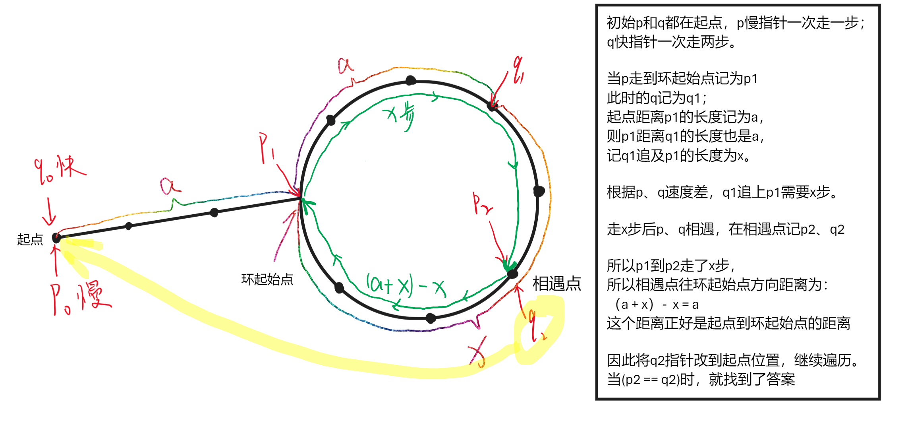

# 链表及其经典问题

Q:树也是特殊的链表吗？

A: 树就是树、链表就是链表。在程序实现方面，可以说二者相像。链表增加一个指针域就变成了二叉树。但是在思维逻辑结构方面来讲是完全不一样的。*不要把树当成一种特殊的链表*。有两个指针域的链表也是双向链表。


head就是一个指针，不是一个具体的对象(结点)

1.链表中的每个结点至少包含两个部分:数据域与指针域

2.链表中的每个结点，通过指针域的值，形成一个线性结构

3.查找结点 O(n)，插入结点 O(1)，删除结点 O(1)

4.不适合快速的定位数据，适合动态的插入和删除数据的应用场景

## 链表的几种实现

结构体：
```C++
struct Node {
    int data;
    Node* next; 
};
```

代码：
```C++
#include <iostream>
using namespace std;

struct Node {
    // 构造函数
    Node(int d) : data(d), next(nullptr) {}
    int data;
    Node* next;
};

int main() {
    Node* head = NULL;
    head = new Node(1);
    head->next = new Node(2);
    head->next->next = new Node(3);
    head->next->next->next = new Node(4);

    // 遍历
    Node* p = head;
    while (p != nullptr) {
        printf("%d->", p->data);
        p = p->next;
    } printf("\n");

    return 0;
}
```

数组模拟链表：
```C++
#include <iostream>
// using namespace std; // 不注释会导致next报重定义。next是保留字

int data[10];
int next[10];

// 在idx结点后面添加node结点，node结点值为val
void add(int idx, int node, int val) {
    next[node] = next[idx]; // 插入两步
    next[idx] = node;
    data[node] = val;
}

int main() {
    int head = 3; // 比如头结点在地址3上
    data[3] = 0;

    add(3, 5, 1);
    add(5, 2, 2);
    add(2, 7, 3);
    add(7, 9, 4);
    add(5, 1, 123); // 中间插入测试

    int p = head;
    // 遍历
    while (p != 0) {
        printf("%d->", data[p]);
        p = next[p];
    } printf("\n");

    return 0;
}
```

**由此重点突出，链表更是一种思想，而不是重代码如何书写**

## 链表的典型应用场景

**场景1 OS内的动态分配内存**

**场景2 LRU缓存淘汰算法**

## 链表经典题-链表的访问

**leetcode 141 环形链表**

* 思路一：哈希表


* 思路二：快慢指针


```C++
class Solution {
public:
    bool hasCycle(ListNode *head) {
        if (head == nullptr)   return false; // 空链表肯定没环
        ListNode *p = head, *q = head->next; // p是慢指针，q是快指针
        while (p != q && q && q->next) { // 如果 p != q 且 q 、q->next都不为空
            // 慢指针走一步，快指针走两步
            p = p->next;
            q = q->next->next;
        }
        return p == q;
    }
};
```
或者（更好的可读性）：
```C++
class Solution {
public:
    bool hasCycle(ListNode *head) {
        // if (head == nullptr)   return false; // 空链表肯定没环
        ListNode *p = head, *q = head; // p是慢指针，q是快指针
        while (q && q->next) { // 用q->next必须判断q->next->next不为空，q同理
            // 慢指针走一步，快指针走两步
            p = p->next;
            q = q->next->next;
            if (p == q) return true;
        }
        return false;
    }
};
```
**leetcode 142 环形链表II**

此题找环的起始点。



```C++
class Solution {
public:
    ListNode* detectCycle(ListNode* head) {
        if (head == nullptr)  return nullptr;
        ListNode *p = head, *q = head->next;
        while (p != q && q && q->next) {
            p = p->next;
            q = q->next->next;
        }
        if (!(q && q->next))  return nullptr;
        p = q = head;
        do {
            p = p->next;
            q = q->next->next;
        } while (p != q);
        p = head;
        while (p != q) {
            p = p->next;
            q = q->next;
        }
        return q;
    }
};
```
或者（可读性更好）：
```C++
class Solution {
public:
    ListNode* detectCycle(ListNode* head) {
        ListNode *p = head, *q = head;
        while (q && q->next) {
            p = p->next;
            q = q->next->next;
            if (p == q)  break;
        }
        if (!(q && q->next)) return nullptr;
        p = head;
        while (p != q) {
            p = p->next;
            q = q->next;
        }
        return p;
    }
};
```

**leetcode 202 快乐数**

这个题体现出链表思维(**唯一指向思维**)，每个数之间都是有唯一的指向关系的。


本质上就是链表判环的问题，把1当成NULL

还是使用快慢指针来解决。

```C++
class Solution {
public:
    int getNext(int n) {
        int sum = 0;
        while (n) {
            sum += (n % 10) * (n % 10);
            n /= 10;
        }
        return sum;
    }

    bool isHappy(int n) {
        int p = n, q = n;
        do {
            p = getNext(p);
            q = getNext(getNext(q));
        } while (p != q && q != 1);
        return q == 1;
    }
};
```

Q：会不会数字越来越大？

A：假设数字x->x' x'会不会越来越大？ 我们设x在int范围内能取到的最大数19 9999 9999，那么这个数根据运算规则x' = 81 * 9 + 1 = 730。所以这个链表顶多最长的长度也就是731个结点。
所以不会越来越大。


## 链表经典题-链表的反转

**leetcode 206 反转链表**

方法1：三个指针，遍历原链表，之间原地反转原链表的当前头结点。

初始状态为：


核心搞三个指针：pre指向反转链表的head，cur指向未反转的head，next是未反转头的下一个位置。

然后：
cur指向pre，指针反转；

此时新来的cur就是新的head，所以pre指向cur。

然后cur指向next，next指向cur->next。

```C++
class Solution {
public:
    ListNode* reverseList(ListNode* head) {
        if (head == nullptr)    return head;
        ListNode *pre = nullptr, *cur = head, *nxt = head->next;
        while (cur) {
            cur->next = pre;
            pre = cur;
            (cur = nxt) && (nxt = nxt->next);
        }
        return pre;
    }
};
```


方法2：把原链表拆分成一个新的链表，不断的遍历原链表，每次将原链表的头结点 **通过头插法** 插入到新链表当中。 本质同方法1。
```C++
class Solution {
public:
    ListNode* reverseList(ListNode* head) {
        if (head == nullptr)    return head;
        ListNode new_head, *cur = head, *nxt = head->next;
        while (cur) {
            cur->next = new_head.next;
            new_head.next = cur;
            (cur = nxt) && (nxt = nxt->next);
        }
        return new_head.next;
    }
};
```

方法3：递归

通过递归的回溯来逆序遍历，相当于反转
```C++
void reverse(Node *p) {
    if (p == nullptr) return;
    reverse(p->next);
    printf("%d->", p->data);
    return;
}
```

首先，先给递归函数一个语义信息：

假设head后面的结点已经反转完毕，那么head应该接在即反转后的尾结点tail，也就是未发生反转前的head->next。

所以要先记录一下未发生反转前的*tail = head->next，然后开始递，思考递归函数的边界：链表为空、或者链表只有一个结点，不需要反转，直接return head。

所以归的时候返回的就是指向新链表的头指针。

然后后续就是在这个新链表进行尾插。


```C++
class Solution {
public:
    ListNode* reverseList(ListNode* head) {
        if (head == nullptr || head->next == nullptr)    return head;
        ListNode *tail = head->next, *new_node = reverseList(head->next);
        head->next = tail->next; // 尾插 或者写成head->next = nullptr
        tail->next = head;
        return new_node;
    }
};
```
**leetcode 92 反转链表II**

这个题需要重点理解虚拟头结点的概念。当头结点的地址可能发生改变的情况，使用虚拟头结点更方便编码。

```C++
// 扩展反转链表:反转前n个结点
Node* reverse(Node *head, int n) {
    if (n == 1) return head;
    Node *tail = head->next, *new_head = reverse(head->next, n - 1); 
    head->next = tail->next; // 这里不能写成head->next = nullptr,因为不是尾插
    tail->next = head;
    return new_head;
}
```


定位到m的前一个位置p，然后使用刚刚的扩展函数：反转前n - m + 1个结点。

```C++
class Solution {
public:
    ListNode* reverseN(ListNode *head, int n) {
        if (n == 1) return head;
        ListNode *tail = head->next, *new_head = reverseN(head->next, n - 1);
        head->next = tail->next;
        tail->next = head;
        return new_head;
    }
    ListNode* reverseBetween(ListNode* head, int left, int right) {
        // 虚拟头结点要真实的结点，不能是指针
        ListNode ret(0, head), *p = &ret; // p是虚拟头指针
        int cnt = right - left + 1;
        while (--left) p = p->next; // 遍历m - 1次，即m前一个位置
        p->next = reverseN(p->next, cnt);
        return ret.next;
    }
};
```
**leetcode 25 K个一组翻转链表**

还是可以基于reverseN函数实现。


用q记录p->next，因为这是下一次p开始的位置。

```C++
class Solution {
public:
    ListNode* reverseN(ListNode* head, int n) {
        if (n == 1)    return head;
        ListNode *tail = head->next, *new_head = reverseN(head->next, n - 1);
        head->next = tail->next;
        tail->next = head;
        return new_head;
    }

    ListNode* init(ListNode* head, int n) {
        // 先判断够不够n个结点
        ListNode* p = head;
        int cnt = n;
        while (--cnt && p)    p = p->next; 
        if (p == nullptr)     return head; // p为空说明不够长度
        return reverseN(head, n);
    }
    ListNode* reverseKGroup(ListNode* head, int k) {
        ListNode ret(0, head), *p = &ret, *q = p->next;
        while ((p->next = init(q, k)) != q) {
            p = q;
            q = p->next;
        }
        return ret.next;
    }
};
```

